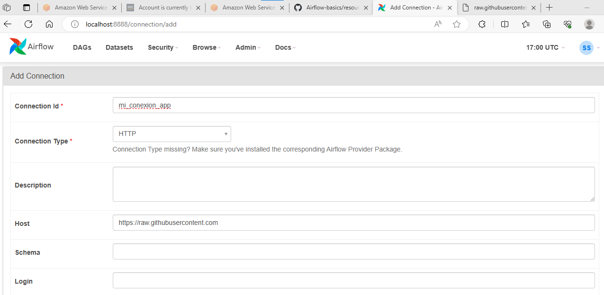

# Introducción a __AIRLFOW__

1. [Introduccion](#Introduccion)
2. [Operadores](#Operadores)
    - [DummyOperator](#DummyOperator)
    - [PythonOperator](#PythonOperator)
    - [BashOperator](#BashOperator)
3. [Providers](#Providers)
    - [HttpSensor](#HttpSensor)
    - [Otros](#Otros)

## Introduccion

- ¿Qué es un DAG? 

Directly Acyclic Graph. Está formado por dags y tareas.

librerias importantes

```python
from  datetime import datetime
from airflow import DAG
```

## Declaracion de un dag 

```python
xx = DAG(
        dag_id=
        description=
        schedule_interval='* * * * *'
        start_date=datetime()
        catchup=False # se usa para ejecutar lo que no corrio
        )
```

## Operadores

### DummyOperator

```python
from airflow.operators.dummy_operator import DummyOperator
```

### Importante

- El operador __DUMMY__ se puede usar para crear o simular una arquitectura inicial y luego reemplazar cada tarea por el operador real

```python
task_1 = DummyOperator(
                        task_id=,
                        dag=...
                        )
```


### Ejecucion

task_1


### PythonOperator

```python
from airflow.operators.python import PythonOperator
```

### Importante

El operador de Python llama a una funcion que puede estar declara en el mismo .py o en otro archivo.

```python
def mi_funcion_python():
    print('Mi primer funcion\n')
    return True

dag = DAG (
            dag_id=
            ...
            )

task_1 = PythonOperator(
                            task_id = ''
                            python_callable=mi_funcion_python
                            dag = 
)
```


### BashOperator

```python
from airflow.operators.bash_operator import BashOperator
```

### Importante

- Ejecuta comandos bash como __sleep__ o __wget__ entre otros

```python
task_1 = BasOperator(
                        task_id = 
                        bash_command='sleep 2;otro comando'
                        dag = dag
)
```

## Providers

### HttpSensor

```python
from airflow.providers.http.sensors.http import HttpSensor
```

### Importante

- Este sensor se usa para saber si un servicio web está activo o no.
- Como es un provider es necesario declararlo en AIRFLOW desde admin-> connectios.
- Este operador tiene un parametro __response_check__ que espera una funcion para que trabaje con la respuesta. Esta funcion  debe devolver un bool

```python
def test_con(respuesta):
    if respuesta is not null:
        print('Conexion establecida')
    return True

task_1 = HttpSensor(
                        task_id =,
                        http_conn_id='mi_conexion_app'
                        endpoint='/caece-nico/Airflow-basics/master/resources_installation/session5/customer.csv'
                        response_check=lambda response : test_con(response.text)
                        poke_interval=segundos
                        timeout=segundos
)
```

### Como configurar la conexión para usar en un HttpSensor




