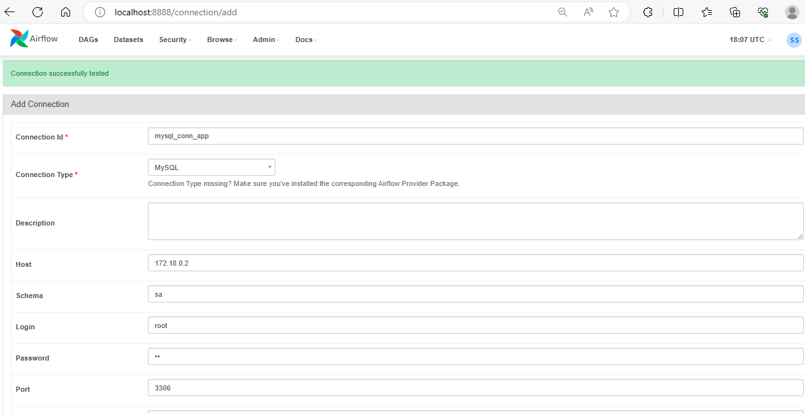
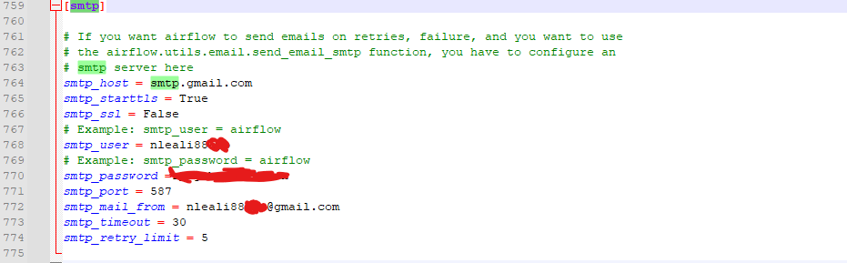
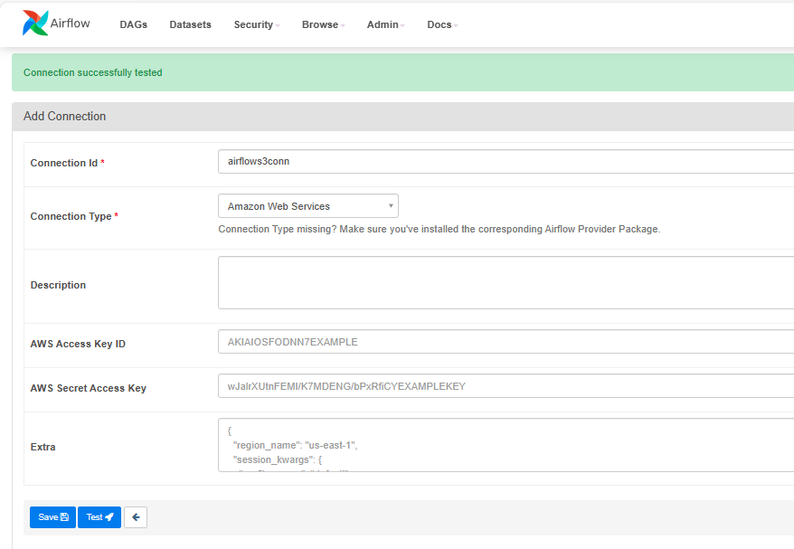

# Introducción a __AIRLFOW__

1. [Introduccion](#Introduccion)
2. [Operadores](#Operadores)
    - [DummyOperator](#DummyOperator)
    - [PythonOperator](#PythonOperator)
    - [BashOperator](#BashOperator)
    - [SimpleHttpOperator](#SimpleHttpOperator)
    - [MySqlOperator](#MySqlOperator)
    - [EmailOperator](#EmailOperator)
    - [BranchOperator](#BranchOperator)
    - [xcon](#xconn)
3. [Providers](#Providers)
    - [HttpSensor](#HttpSensor)
    - [Otros](#Otros)
4. [Hooks](#Hooks)
    - [MySqlHook](#MySqlHook)
    - [S3Hook](#S3Hook)
5. [Sensores](#Sensores)
    - [FileSensor](#FileSensor)

## Introduccion

- ¿Qué es un DAG? 

Directly Acyclic Graph. Está formado por dags y tareas.

librerias importantes

```python
from  datetime import datetime
from airflow import DAG
```

## Declaracion de un dag 

```python
xx = DAG(
        dag_id=
        description=
        schedule_interval='* * * * *'
        start_date=datetime()
        catchup=False # se usa para ejecutar lo que no corrio
        )
```

## Operadores

### DummyOperator

```python
from airflow.operators.dummy_operator import DummyOperator
```

### Importante

- El operador __DUMMY__ se puede usar para crear o simular una arquitectura inicial y luego reemplazar cada tarea por el operador real

```python
task_1 = DummyOperator(
                        task_id=,
                        dag=...
                        )
```


### Ejecucion

task_1


### PythonOperator

```python
from airflow.operators.python import PythonOperator
```

### Importante

El operador de Python llama a una funcion que puede estar declara en el mismo .py o en otro archivo.

```python
def mi_funcion_python():
    print('Mi primer funcion\n')
    return True

dag = DAG (
            dag_id=
            ...
            )

task_1 = PythonOperator(
                            task_id = ''
                            python_callable=mi_funcion_python
                            dag = 
)
```


### BashOperator

```python
from airflow.operators.bash_operator import BashOperator
```

### Importante

- Ejecuta comandos bash como __sleep__ o __wget__ entre otros

```python
task_1 = BasOperator(
                        task_id = 
                        bash_command='sleep 2;otro comando'
                        dag = dag
)
```

### SimpleHttpOperator

```python
from airflow.providers.http.operators.http import SimpleHttpOperator
```

### Importante

- Este operador generalmente trabaja junto al sensor [HttpSensor](#HttpSensor). Su función es obtener algo de una conexión web por ejemplo un archivo __.csv__
- El resultado se puede pasar a un __PythonOperator__ para grabar el archivo, por ejemplo.

```python
def graba_json(respuesta):
    with open('/opt/....', 'w') as f:
        f.write(respuesta)
    return True

task_1 = SimpleHttpOperator(
                                task_id = ''
                                http_conn_id = 'mi_conn_app'
                                endpoint= ''
                                method = 'GET'
                                log_resposne = True
                                response_filter = lambda response: graba_json(response.text)
                                dag = dag
)
```

### MysqlOperator

```python
from airflow.operators.mysql_operator import MySqlOperator
from airflow.hooks.mysql_hook import MySqlHook
```

#### Importante

- Para poder trabajar con MySql necesitamos crear la conexión al igual que con [HttpSensor](#HttpSensor). Indicando la IP, del contenedor de Docker donde corre MySql. EL nombre de usuario, la pass y el esquema al que nos vamos a conectar.

- ¿Quien maneja la conexión para inserts?

El encargado de establecer la conexión y cerrarla es el __HOOK__.

```python
import json

#creamos una tabla usando el operador

crea_tabla_task = MySqlOperator(
                                    task_id = ''
                                    mysql_conn_id = ''
                                    sql = r"""
                                                sentencia sql ;
                                            """
                                    dag = dag
)

#insertamos registros usando el operador y hook.

@mi_dag.task(task_id = '')
def inserta_mysql_hook():
    mysql_hook = MySqlHook(mysql_conn_id= '', schemma = '')
    with open('opt/.....json','r') as f:
        data = json.loads(f.read())
        d_list = []
        for items in data:
            dlist.append((items['id'], items['title']))
        target_field = ['post_id', 'post']
        mysql_hook.inserts_rows(table='mi_tabla',rows=dlist, target_fields=target_field)


```

### Detalle

- El __Hook__ necesita metadata para poder funcionar correctamente por eso debemos especificar.
    - El nombre de la tabla donde vamos a insertar.
    - Los campos de la tabla
    - Y los datos en forma de tuplas.

### Creamos la conexión.




### EmailOperator

```python
from airflow.operators.email_operator import EmailOperator
```

### Importante

- Para usar el __EMAILOPERATOR__ es necesario configurar una cuenta de email que servirá como servidor smtp, para esto se debe modificar el archivo de configuracion de __airflow.cfg__.

- Para modificar el __airflow.cfg__ lo vamos a copiar desde el contenedor a nuestra pc y luego copiarlo modificado.

```docker
mi_directorio> docker cp id_contenedor:/opt/.../airflow.cfg airflow.cfg
```

```python
envia_email = EmailOperator(
                                task_id = ''
                                to='xxxx@xxxx.com'
                                subject=''
                                html_content=''
                                dag=dag
)
```

### Cómo modificar el archivo de configuracion.




### BranchOperator

```python
from airflow.operators.python import BranchPythonOperator
```

#### Importante

- Es un operador para determinar el flujo de la ejecución de un sistema. Funciona como un IF ELSE.

```python
def f_controla():
    if valor > 1:
        'envia_mail'
    else:
        'graba_db'
    return True


task_1 = PythonBranchOperator(
                                task_id = ''
                                python_callable=f_controla
                                dag = dag
)

envia_mail = EmailOperator(
                            task_id = 'envia_mail'
                            to = 
                            subject = ''
                            html_content = ''
                            dag = dag
)

graba_db = PythonOperator(
                            task_id ='graba_db'
                            python_callable=mi_funcion_x
                            dag=dag
)

task_1>>[envia_mail,graba_db ]
```

- El __BranchPythonOperator__ es una funcion de python que usa un IF ELSE para ejecutar otra funcion de Python u otro operador.
- Estos operadores son tareas que se deben llamar en el IF ELSE por nombre.
- Al momento de ejecutar el dag determina el camino que debe tomar.


### xconn

- Xconn no es propiamente un operador de Airflow. Se usa como mecanismo para intercambiar mensajes entre tareas.
- Tiene dos componentes básicos: __xcon_push__ y __xcon_pull__.
- Estos dos componentes son accesibles a travez de un parametro llamado __ti__ al que se accede desde una funcion python.

```python
def f_procesa_datos(ti):
    dato = 10
    ti.xcon_push(key='Nombre_xconn', value=dato)
    return True

tarea_procesa_datos = PythonOperator(
                                        task_id = 'mi_tarea_xconn'
                                        python_callable=f_procesa_datos,
                                        dag=dag
)
```

```python
def f_controla_datos(ti):
    valores = ti.xcon_pull(key='Nombre_xconn', task_ids=['mi_tarea_xconn'])
    return True

tarea_controla_datos = PythonOperator(
                                        task_id = '',
                                        python_callable= f_controla_datos,
                                        dag = dag
)
```

#### Importante

__xcon_push__ tiene un parametro que lo identifica, __key__ es su nombre para que sea llamado por el xcon_pull.
__xcon_pull__ debe tener la referencia a la tarea __pythonOperator__ que contiene al __xcon_push__


## Providers

### HttpSensor

```python
from airflow.providers.http.sensors.http import HttpSensor
```

### Importante

- Este sensor se usa para saber si un servicio web está activo o no.
- Como es un provider es necesario declararlo en AIRFLOW desde admin-> connectios.
- Este operador tiene un parametro __response_check__ que espera una funcion para que trabaje con la respuesta. Esta funcion  debe devolver un bool

```python
def test_con(respuesta):
    if respuesta is not null:
        print('Conexion establecida')
    return True

task_1 = HttpSensor(
                        task_id =,
                        http_conn_id='mi_conexion_app'
                        endpoint='/caece-nico/Airflow-basics/master/resources_installation/session5/customer.csv'
                        response_check=lambda response : test_con(response.text)
                        poke_interval=segundos
                        timeout=segundos
)
```

### Como configurar la conexión para usar en un HttpSensor


## Hooks

### MySqlOperator

Ver [MySqlOperator](#MySqlOperator)


### S3Hook

```python
from airflow.hooks.s3_hook import S3Hook
```

### Importante

- El __S3Hook__ es similar al MySqlHook, tambien se usa para transferir datos de una fuente a otra usando alguna conexión existente en Airflow.
- Para poder configuarar la conexion de __S3Hook__ es necesario instalar AWS cuando levantamos Docker. Esto esta incluido en el tutorial de [Docker-Compose](#session6/readme.md)

```python
def f_copia_archivo(file_name, key, bucket_name):
    hook=S3Hook('airflows3conn')
    hook.load_file(filename = file_name, key = key, bucket_name = bucket_name)


task_1 = PythonOperator(
                            task_id = ''
                            python_callable = f_copia_archivo,
                            op_kwargs=
                                        {
                                            'file_name':'opt/....csv',
                                            'key':nombre_archivo,
                                            'bucket_name':''
                                        }
)

```

#### configuracion conexion S3

- Debemos crear un usuario y descargar la key y la secret key y guardarlo.




## Sensores

### FileSensor

```python
from airflow.sensors.fileSystem import FileSensor
```

### Importante

- El __Filesensor__ sirve para detectar cuando un archivo es cargado en un carpeta para que podamos trabajar con el.
- Hay que tener en cuenta que va a mantener lockeado un recurso para que llegue a su time out.

```python

def f_funcion(context):
    print('Error')
    return True

task_filesensor = FileSensor(
                                task_id = ''
                                filepath='opt/...'
                                poke_interval=in seconds
                                timeout=in seconds
                                on_failure=f_funcion
                                dag=dag
)

def f_hace_algo():
    print('Hay un archivo podemos hacer algo con el por ejemplo subirlo a s3 con el S3Hook')
    return True

abre_archivo = PythonOperator(
                                task_id = ''
                                python_callable = f_hace_algo
                                dag = dag
)
```