# Introduction to Airflow - Udemy

1. [Introduccion](#1.-Introduccion)
    - [Requisitos]()
    - [Core components]()
2. [Arquitecturas de Airflow](#2.-Arquitecturas-de-airflow)
    - [Single Node]()
    - [Cellery]()
    - [¿Como funciona?]()
3. [Instalar Apache Airflow](#3.-Instalar-apache-airflow)
    - [Logeo en Airflow WebServer]()
    - [Conociento Airflow UI]()

## 1. Introduccion

__¿Porque necesitamos Airflow?__

_Airflow_ nos permite manejar errores en nuestros Pipelines de forma eficiente y fácil.
POr ejemplo si tenemos un __Pipeline__ que consume, una API, carga con Snowflake y procesa con Dbt

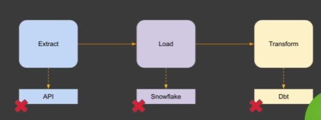

Con Airflow podemos capturar cualquier error es los pasos de este __Pipeline__ y determinar el curso de acción alternativo.

__¿Qué es Airlfow?__

Es una plataforma de codigo abierto para monitorear los workflows del data pipeline.
Permite __crear__, __monitorear__ y __esquedulear__ nuestros Workflows.

Tiene su porpia UI y permite crear nuestras propias Plug-in.

### Core components

Tiene un __web server__, un __Scheduler__ , un __metastore__ y un __triggerer__
Tambien tenemos el __executor__. El Executor no ejecuta tareas pero dice como se deben ejecutar. Por ejemplo si queremos ejecutar sobre Kubernetes, usamos el __Kubernetes Executor__ si queremos ejecutar en paralelo usamos __Cellery Executor__.

Cuando ejecutamos en paralelo tenemos dos componentes adicionales que son __Queue__ y __Worker__. Las tareas se van encolando en la   __Queue__ que serán tomadas por el __Worker__

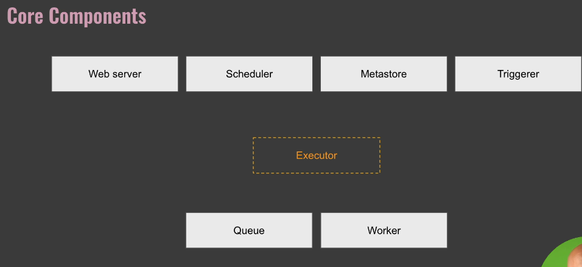

__¿Que son los DAGs?__

Significa Directly Aciclic Graph. Compuesto por Aristas o Nodos, Edges y __sin Ciclos__.

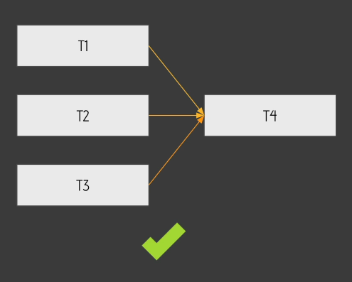

En este ejemplo vemos que __T1 T2 y T3__ son aristas o nodos (Task) que ejecutan en paralelo.
__T4__ tambien es un Nodo o Artista que depende de __T1 T2 y T3__. La dependencia se da por Edges.

__¿Que es un Operator?__

Un operador es una forma de encapsular lo que queremos hacer. 
Hay tres tipos.

|Tipo de operador|descripcion|ejemplo|
|----------------|-----------|-------|
|Action Operator|Ejecutan una función u Operacion|__PythonOperator__ o __BashOperator__ o __SparkSubmitJobOperator__|
|Transfer Operator|Pueden caer en desuso pero un ejemplo es para mover datos de MySQL a Redshift|__TransferOperator__|
|Sensor Operator|Se usan para esperar que algo ocurra antes de pasar a la siguiente tarea|__FileSensor__|


__¿Que es Task y Task Instance?__

Un operador es una __Tarea__ o __Task__ y cuando esto es ejecutado obtenemos un __Task Instance__

__¿Que es un Workflow?__

Es la combinacion de todos los conceptos anteriores.

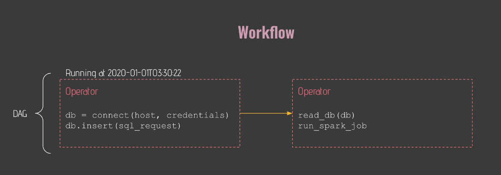

### Lo que no es Airflow.

__Airflow__ no es un Data Streaming solution neither a Data Processing Frameworks.

Airflow no funciona si ejecutamos una tarea o workflow cada 1 segundo en streaming.
Tampoco se deberia usar como una herramienta de procesamiento de datos, ya que no se espera que los datos sean procesados en Airflow. Pero si es esperable que airflow sea usado como una herramienta que dispara el procesamiento en otras herramientas como __SparkSubmitJobOperator__. En definitiva es una __orquestador de Workflows__

## 2. Arquitecturas de Airflow.

### Single Node Architecture.

En esta arquitectura es la mas fácil para deployar Airflow.

__Importante__ Recordar que el _Executor_ forma parte del __Scheduler_ y no eejcuta la tarea pero determina como se ejecutará.

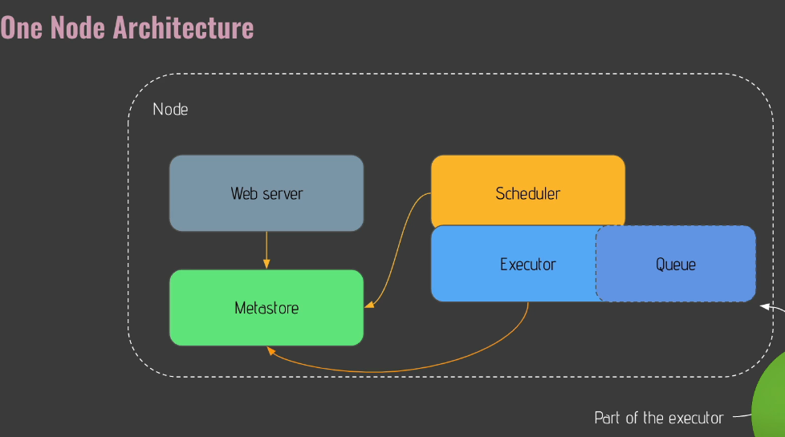

En esta arquitectura el __web server__ se comunica con la __Metastore__ al igual que los otros componentes.

Independientemente del __Executor__ que elijamos __Queue__ simepre está y forma parte del __Executor__

### Celery Architecture.

Cuando queremos ejecutar Airflow en producción no vamos a usar __single node Architecture__.
La idea es no tener un unico punto de falla y que sea tolerante a fallos. Por eso __elegimos una arquitectura multi nodos__

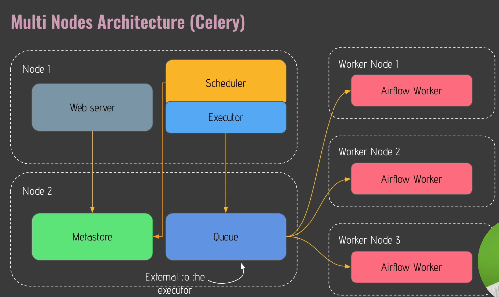


En esta arquitectura vemos que las tareas se van __encolando__ en __redis__ y es el encargado de ir pansadolas a cada __worker__ en el orden correcto. Para ejecutar mas tareas solo debemos aregar mas __workers__.

__Optimizacion__ En esta arquitectura podriamos tener un __Load balancer__ delante del __Web server__ para balancear la carga de conexiones.

### ¿Cómo funciona esto?

1. Tenemos un nuevo __DAG__ y lo ponemos en la carpeta de DAGs.
2. Cada 5 Minutos por default el __scheduler__ busca nuevos dags en la carpeta o por cambios en los que ya existen.
3. El __Scheduler__ crea un __DagRun Object__ con el estado __Running__
4. Luego toma la primera __task__ para ejecutar y esa task se convierte en una __TaskInstance__. En este momento el _TaskInstance__ tiene el estado None.

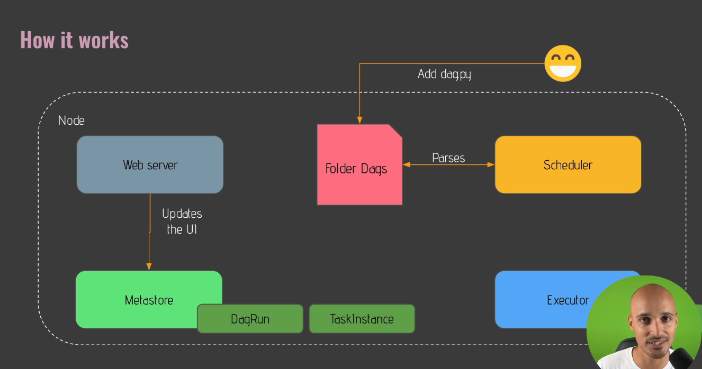

5. Luego el __Scheduler__ envia el objeto de instancia a la cola del __Executor__ y en este momento el estado de la tarea es __Queued__.
6. El __Executor__  crea un subproceso para ejecutar la tarea y ahora tiene el estado __Running__
7. Una vez que terminado el __Executor__ cambia el esatdo de la __TaskInstance__ y el __Scheduler__ controla que no haya errores o tareas sin ejecutar.
8. Finalmente la tarea tiene el estdo __Succesed__

### Requisitos

1. Necesitamos tener instalo Docker. [Docker Link](https://docs.docker.com/get-docker/)
2. Luego Instalar Visual Studio Code. [Vs Code](https://code.visualstudio.com/download)
3. Instalacion de Docker en Windows [Link](https://www.youtube.com/watch?v=lIkxbE_We1I&ab_channel=JamesStormes)
- 3.1 Instalacion de Docker Windows WLS2 [Link](https://www.youtube.com/watch?v=h0Lwtcje-Jo&ab_channel=BeachcastsProgrammingVideos)
- 3.2 Instalacion de Docker en Windows 11 [Link](https://youtu.be/6k1CyA5zYgg?t=249)


# 3. Instalar Apache Airflow


1. Creamos una carpeta Documents/ Materials
y descargamos el archivo [docker-compose](https://airflow.apache.org/docs/apache-airflow/2.5.1/docker-compose.yaml)

2. Removemos el __.txt__ del archivo __docker-compose.yaml__

3. Abrimos una terminal y nos posicionamos dentro de la carpeta que creamos en 1.

4. abrimos __Visual Studio Code__ y deberiamos ver el archivo __docker-compose__

5. En __VSCODE__ creamos un nuevo archivo __.env__ y agregamos las lineas.

```yaml
AIRFLOW_IMAGE_NAME=apache/airflow:2.4.2
AIRFLOW_UID=50000
```

6. EN una nueva terminal escribimos.
```yaml
docker-compose up -d
```

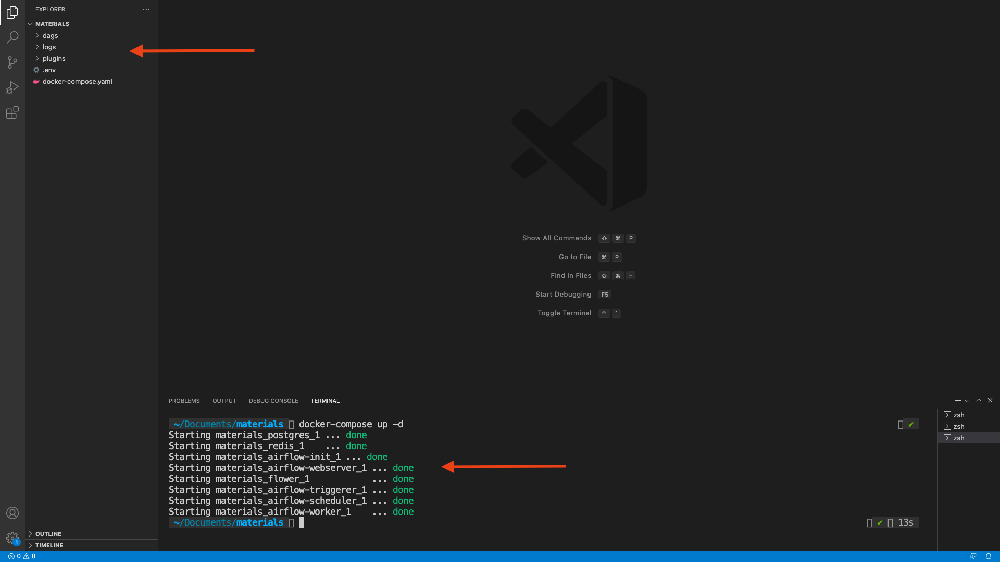

7. Una vez instalado vamos a __localhost_8080__

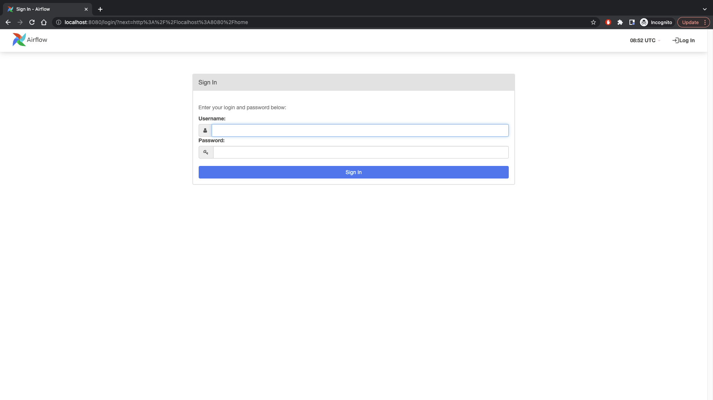

__IMPORTANTE__

Podemos chekear el correcto funcionamiento de la aplicaciones desde:

```yaml
docker-compose ps
```

Ante un error buscamos en los logs y detenemos el container.

```yaml
docker logs materials_name_of_the_container
docker-compose down
docker volume prune
docker-compose up -d 
```

### Logeo en Airflow Web-Server

El servicio de Web-Server de Airflow es lo último que levanta y puede tardar mas de 10 minutos.
Ingresamos con airflow/airflow

Lo primero que vamos a ver son los ejemlos que ya vienen por ejemplo.

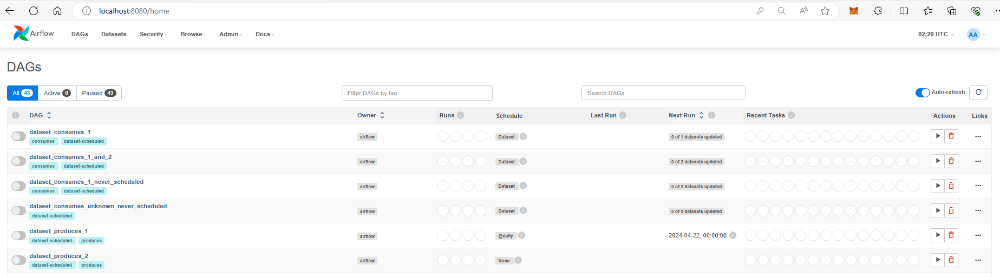

en esta pantalla inicial vemos informacion relacionada a los DAGS y a su ejecución actual y pasada. Como por ejemplo, la cantidad de DAGS en cola de ejecución, los que se están ejecutando, los que dieron error, etc. 
Tambien vemos el último que ejecutó y el próximo que lo hará.

### Conociendo Airflow UI.

1. The Grid View

Cuando hacemos Click sobre un DAGS lo primero que vemos en the Grid View.
Lo que nos permite es ver la historia de los estados del DAGS.
Tambien nos muestra la cantidad total de __Task__ que contiene el DAG y los __Operators__ que usa.


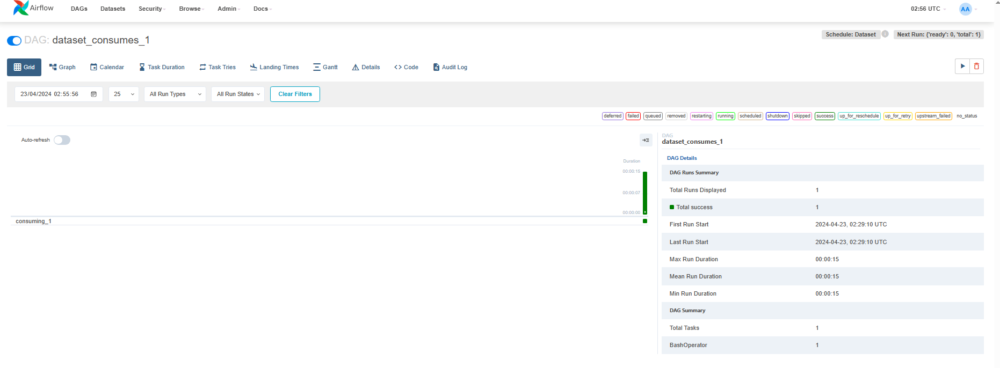

2. The Graph View

La vista __graph view__ es muy útil porque nos ayuda a ver como está hecho el DAG y cuales son las dependencias de cada __Task__

Al hacer click sobre cada __Task__ podemos ver propiedades de la misma.

3. Landing View

EL calendar view, es una vista que es útil a medida que vamos ejecutando una mayor cantidad de DAGs. Nos muestra el tiempo de ejecución de los __task__ y ver posibles optimizaciones y comparar contra otros DAGs.

4. Calendar View

En esta vista se ve la agregacion de cada ejecución por día de un DAG en particular. Nos ayuda a obtener patrones de patrones para ver que dias falla.

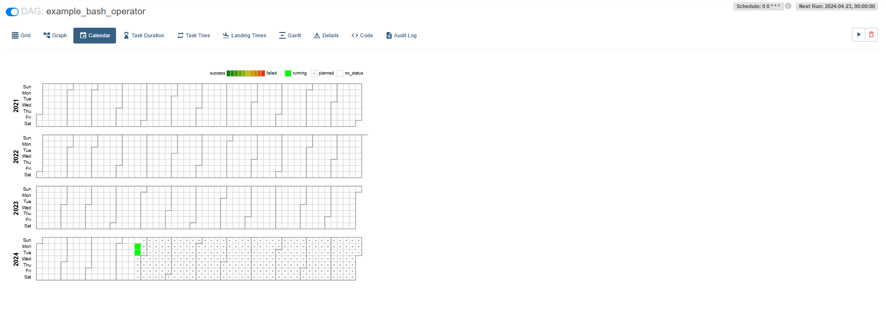

5. Gantt View

Es una de las vistas mas útiles para encontrar __bottelnecks__ en nuestros DAGs.

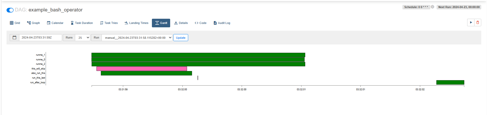

Mientras mas largo sea el rectangulo, mas tiempo tarda en ejecutar.
Si vemos que los rectangulos se sobreponen es porque podemos eejcutar en paralelo.

6. Code View.

La usamos para ver el código. La verdadera utilidad es cuando queremos ver que el código que modificamos ya impacto en __Airflow__


