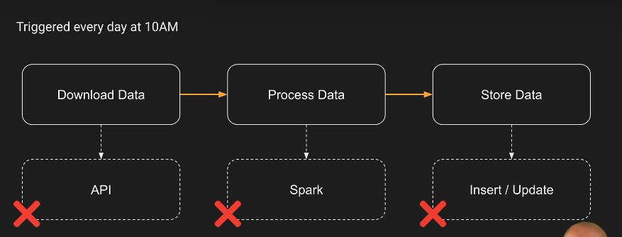
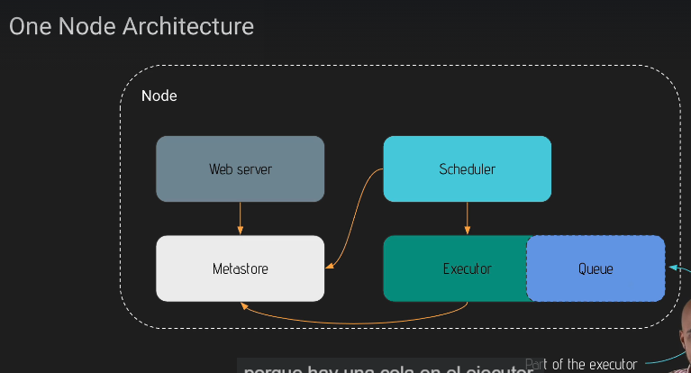
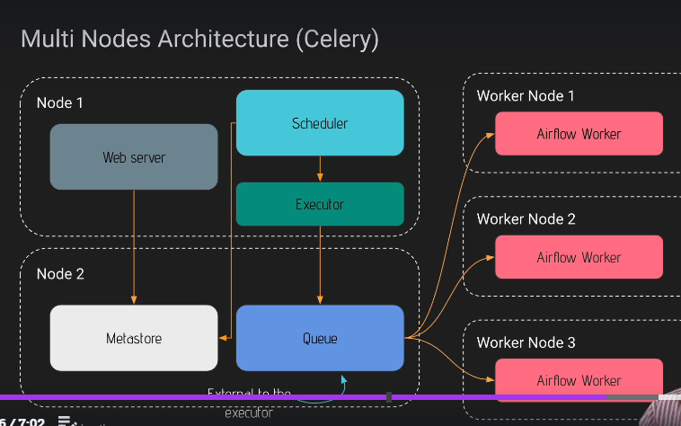
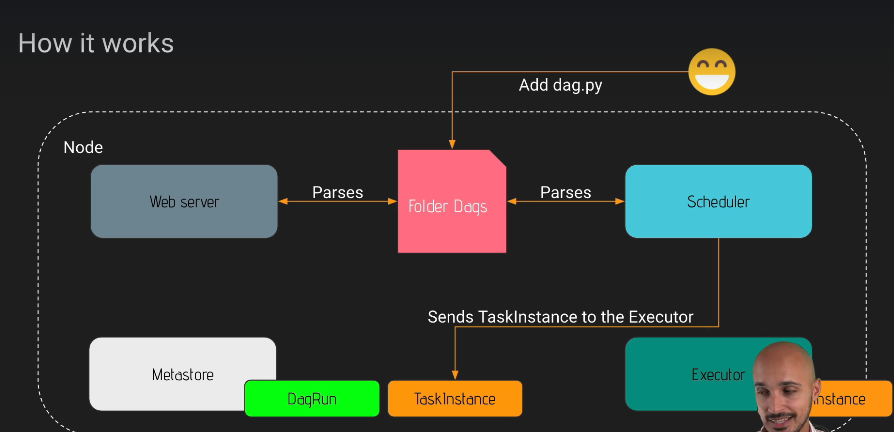

# Airflow HandsOn

## Indice.

1. [Qué es Airflow](#1.-que-es-airflow?)
    - [Como funciona Airflow]()
    - [Instalacion de AIRFLOW - DOCKER]()
    - [Airflow CLI]()
    - [Airflow REST API]()


## 1. Que es Airflow?

Con Airflow podemos monitorear y controlar nuestro Pipeline.



__Apache Airflow__ es una herramienta OPen Source que permite crear, agendar y monitorear Workflows.

Es extensible, no es necesario esperar a que se publique una nueva funcionalidad para un tool, se puede crear por nuestra cuenta.

|componente|descripcion|
|----------|-----------|
|Web Server||
|Scheduler|El corazon de Airflow, define cuando se ejecuta una tarea|
|Meta database| Alamcena la data de nuestras task|
|Tiggerer| Maneja los operadores|
|Executor|Define como y en que sistema se ejecuta la tarea|
|worker| Es una maquina donde se ejecuta la tarea|

### DAG

En el conetxto de Airflow un dag es un pipeline con dependencias entre las tareas, donde las tareas son nodos.

### Operator

Encapsula la logica que queremos aplicar sobre una tarea.

|tipos|descripcion|
|-----|-----------|
|Action|Ejecuta acciones sobre un objeto|
|Transfer|Moeve archivos de un ligar a otro|
|Sensor|Espera a que algo ocurra|
|Deferrable|Es una evolucion de los Sensores|


### Task Instances.

Es un DAG en prpceso de ejecucion, y cuando todos os dags están ejecutan se llaman __Workflow__

## __¿Qué no es Airflow?__

__Airflow__ no es una solución de Streaming o una Herramienta de Procesamiento de Datos. No es un ETL.


## Como funciona Airflow?

- Arquitecturas.

## One Node Architecture.


El web ser obtiene data de la Metadata, al igual que el Scheduler y el Executor.
__Estos tres componentes interactuan entre si por medio de la metadata__ 
El Scheduler busca lo que está listo para ser ejecutado y lo envia al Executor para que decida donde se ejecutará, luego actualiza el estado del DAG.

__Queue__ es una parte del executor.



## Multi Node Arch.

A diferencia de la anterior permite ejecutar varias tareas en forma simultanea en distintos nodos.
En esta arquitectura la __Queue__ está en otro node, NO es parte del Executor.
Esta Queue es la encargada de ir enviando las tareas a los distintos __Workers__  entre multiples maquinas.



Las interacciones son.

EL webServer toma data de la __metadata__ para saber que es lo que tiene que correr, El scheduler interactura con la metadata y envia al Executor las tareas que a la vez son enviadas a la __Queue__ y estas soon tomadas por los Workers a medida que están disponibles para tomar nuevas tareas.

## ¿Qué pasa cuando una tarea es Triggered?__

Cuando ponemos un nuevo DAG en la carpeta de DAGS el Web Server parsea la carpeta, detecta cambios, Lo mismo hace el Scheduler y  se fija si DAG está listo para ser Ejecutado. Luego el Scheduler crea una instancia del DAG (DagRun Object) Es una instancia, que es almacenada en la __Metadata__ con el estado __Running__.
Si hay una tarea lista para ser Activada, el Scheduler crea una __Schedules TaskInstance Object__ con el estado __Programado__ en la __metadata__ Luego el Scheduler envia la tarea al Executor. En este momento el Executor modifica el estdo de la tarea a __Running__ y luego a __COmpleted__ y el Scheduler comprueba el estado de la misma. 



### Instalacion de Airflow - DOCKER


### Airflow CLI


Airflow Command Line Interface Es un complemento a la UI.
Hay algunas cosas que no podemos hacer desde la UI, como ejecutar con __Backfill__

Para ejecutar desde la CLI usamos:

```
docker exec -it docker_id /bin/bash
airflow -h 
```

Esto lo hacemos para ver todos los comandos. Estos comandos están agrupados segun el recurso con el que queremos interactuar.

por ejemplo 

```

```
|comando|descripcion|
|-------|-----------|
|airflow db reset|1. Al reiniciar la BD borramos la metadata|
|airflow db upgrade|2. Despues de actualizar Airflow debemos actaulizar la db.|
|airflow dags list|3. Lo usamos para saber si airflow encontro el nuevo dag.|
|airflow dags tigger example -e fecha| Ejecutamos un DAG en una fecha especifica para pruebas.|
|airflow dags backfill| Lo usamos si queremos ejecutar todos los dags que no ejecutaron entre dos fechas. airflow dags backfill -s 2021-01-01 -e 2021-01-05 --reset-dagruns|
|airflow task test example_bash_operator runme_0 2021-01-01| sirve para verificar si un dag sirve y sus dependecnias están ok|


