# Introduction to Airflow - Udemy

1. [Introduccion](#1.-Introduccion)
    - [Requisitos]()
        - [Entorno Virtual]()
    - [Core components]()
2. [Arquitecturas de Airflow](#2.-Arquitecturas-de-airflow)
    - [Single Node]()
    - [Cellery]()
    - [¿Como funciona?]()
3. [Instalar Apache Airflow](#3.-Instalar-apache-airflow)
    - [Logeo en Airflow WebServer]()
    - [Conociento Airflow UI]()
4. [Proyecto Intro](#4.-proyecto-intro)
    - [Introduccion]()
    - [El primer DAG]()
    - [Operadores y Providers]()
    - [create a connection]()
    - [Ejecutar un task de prueba]()
    - [Sensores]()
    - [Extraccion de datos de la API]()
    - [Python Operator]()
    - [Extra - Hooks y carga de datos]()
    - [Ejecucion del proceso y control]()
    - [Schedule DAGS]()
5. [Nueva forma de usar Scheduler](#5.-nueva-forma-de-usar-scheduler)
    - [DataSets]()
    - [Implementacion]()
6. [Executors](#6.-executors)
    - [Sequential]()
    - [Local]()
    - [Celery y flower]()
    - [Especificar una task para una queue]()
7. [Conceptos avanzados](#7.-conceptos-avanzados)
    - [SubDAGs]()
    - [TaskGroups - Mejor que subdags]()
    - [Excahnge data]()
    - [Branches]()
    - [Branches and triggers]()
8. [Docker Executor](#8.-docker-executor)


## 1. Introduccion

### Entorno Virtual.

Para poder usar las etiquetas inteligentes debemos tener __Airflow__ instalado en nuestra maquina, pero para no interferir con otros paquetes lo vamos a instalar sobre un entorno virtual.

1. Creacion del entorno virtual.

[Podemos seguir este tutorial](https://saturncloud.io/blog/how-to-use-different-python-versions-with-virtualenv/)

para ponder crear este entonro debemos tener el paquete __virtualenv__ 

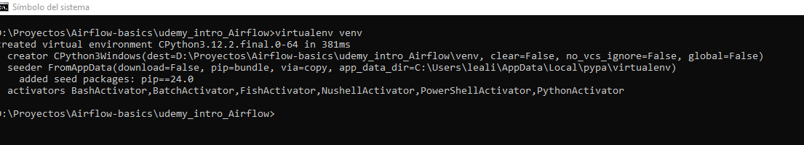

2. Activamos el entorno virtual

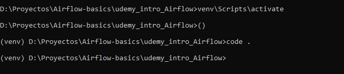

3. Instalamos Airflow

```shell
pip install apache-airflow
```

Ahora deberiamos poder importar los paquetes de __Airflow__ desde el entorno virtual.

__¿Porque necesitamos Airflow?__

_Airflow_ nos permite manejar errores en nuestros Pipelines de forma eficiente y fácil.
POr ejemplo si tenemos un __Pipeline__ que consume, una API, carga con Snowflake y procesa con Dbt

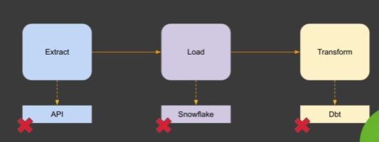

Con Airflow podemos capturar cualquier error es los pasos de este __Pipeline__ y determinar el curso de acción alternativo.

__¿Qué es Airlfow?__

Es una plataforma de codigo abierto para monitorear los workflows del data pipeline.
Permite __crear__, __monitorear__ y __esquedulear__ nuestros Workflows.

Tiene su porpia UI y permite crear nuestras propias Plug-in.

### Core components

Tiene un __web server__, un __Scheduler__ , un __metastore__ y un __triggerer__
Tambien tenemos el __executor__. El Executor no ejecuta tareas pero dice como se deben ejecutar. Por ejemplo si queremos ejecutar sobre Kubernetes, usamos el __Kubernetes Executor__ si queremos ejecutar en paralelo usamos __Cellery Executor__.

Cuando ejecutamos en paralelo tenemos dos componentes adicionales que son __Queue__ y __Worker__. Las tareas se van encolando en la   __Queue__ que serán tomadas por el __Worker__

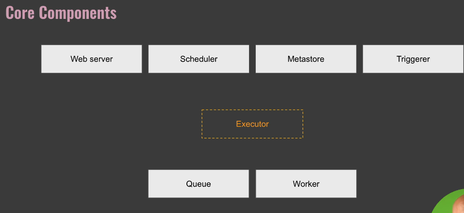

__¿Que son los DAGs?__

Significa Directly Aciclic Graph. Compuesto por Aristas o Nodos, Edges y __sin Ciclos__.

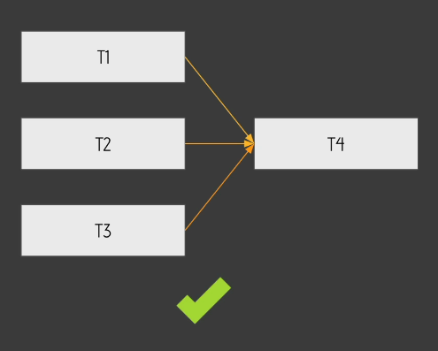

En este ejemplo vemos que __T1 T2 y T3__ son aristas o nodos (Task) que ejecutan en paralelo.
__T4__ tambien es un Nodo o Artista que depende de __T1 T2 y T3__. La dependencia se da por Edges.

__¿Que es un Operator?__

Un operador es una forma de encapsular lo que queremos hacer. 
Hay tres tipos.

|Tipo de operador|descripcion|ejemplo|
|----------------|-----------|-------|
|Action Operator|Ejecutan una función u Operacion|__PythonOperator__ o __BashOperator__ o __SparkSubmitJobOperator__|
|Transfer Operator|Pueden caer en desuso pero un ejemplo es para mover datos de MySQL a Redshift|__TransferOperator__|
|Sensor Operator|Se usan para esperar que algo ocurra antes de pasar a la siguiente tarea|__FileSensor__|


__¿Que es Task y Task Instance?__

Un operador es una __Tarea__ o __Task__ y cuando esto es ejecutado obtenemos un __Task Instance__

__¿Que es un Workflow?__

Es la combinacion de todos los conceptos anteriores.

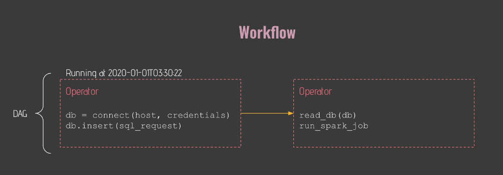

### Lo que no es Airflow.

__Airflow__ no es un Data Streaming solution neither a Data Processing Frameworks.

Airflow no funciona si ejecutamos una tarea o workflow cada 1 segundo en streaming.
Tampoco se deberia usar como una herramienta de procesamiento de datos, ya que no se espera que los datos sean procesados en Airflow. Pero si es esperable que airflow sea usado como una herramienta que dispara el procesamiento en otras herramientas como __SparkSubmitJobOperator__. En definitiva es una __orquestador de Workflows__

## 2. Arquitecturas de Airflow.

### Single Node Architecture.

En esta arquitectura es la mas fácil para deployar Airflow.

__Importante__ Recordar que el _Executor_ forma parte del __Scheduler_ y no eejcuta la tarea pero determina como se ejecutará.

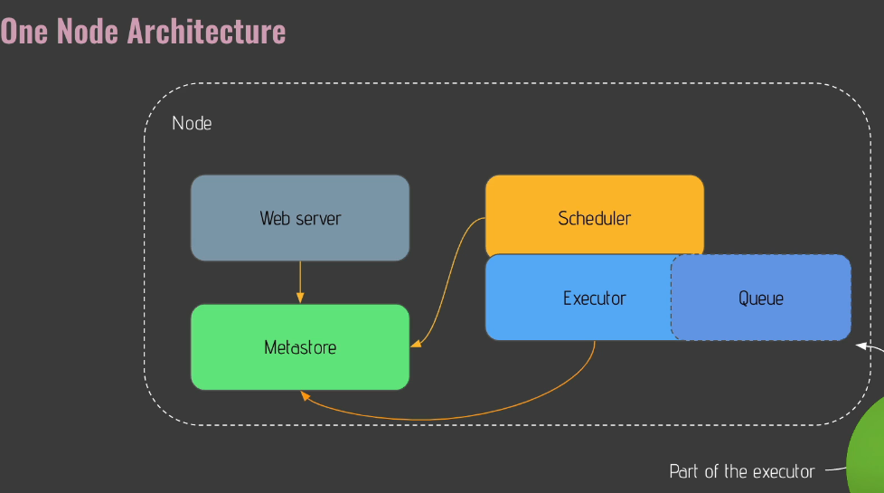

En esta arquitectura el __web server__ se comunica con la __Metastore__ al igual que los otros componentes.

Independientemente del __Executor__ que elijamos __Queue__ simepre está y forma parte del __Executor__

### Celery Architecture.

Cuando queremos ejecutar Airflow en producción no vamos a usar __single node Architecture__.
La idea es no tener un unico punto de falla y que sea tolerante a fallos. Por eso __elegimos una arquitectura multi nodos__

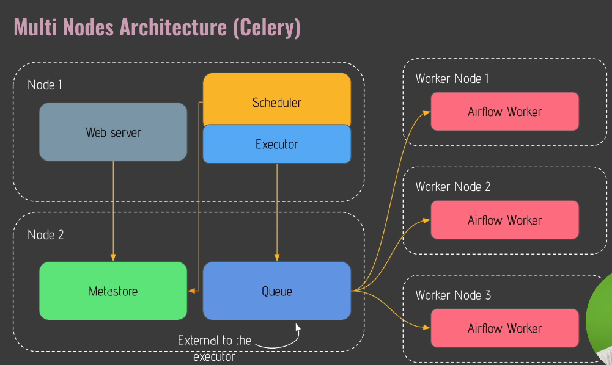


En esta arquitectura vemos que las tareas se van __encolando__ en __redis__ y es el encargado de ir pansadolas a cada __worker__ en el orden correcto. Para ejecutar mas tareas solo debemos aregar mas __workers__.

__Optimizacion__ En esta arquitectura podriamos tener un __Load balancer__ delante del __Web server__ para balancear la carga de conexiones.

### ¿Cómo funciona esto?

1. Tenemos un nuevo __DAG__ y lo ponemos en la carpeta de DAGs.
2. Cada 5 Minutos por default el __scheduler__ busca nuevos dags en la carpeta o por cambios en los que ya existen.
3. El __Scheduler__ crea un __DagRun Object__ con el estado __Running__
4. Luego toma la primera __task__ para ejecutar y esa task se convierte en una __TaskInstance__. En este momento el _TaskInstance__ tiene el estado None.

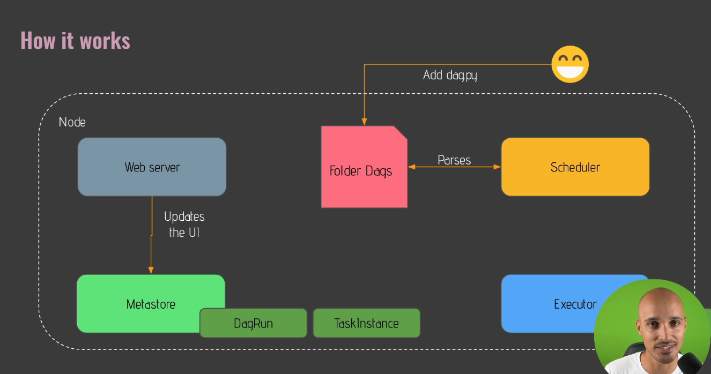

5. Luego el __Scheduler__ envia el objeto de instancia a la cola del __Executor__ y en este momento el estado de la tarea es __Queued__.
6. El __Executor__  crea un subproceso para ejecutar la tarea y ahora tiene el estado __Running__
7. Una vez que terminado el __Executor__ cambia el esatdo de la __TaskInstance__ y el __Scheduler__ controla que no haya errores o tareas sin ejecutar.
8. Finalmente la tarea tiene el estdo __Succesed__

### Requisitos

1. Necesitamos tener instalo Docker. [Docker Link](https://docs.docker.com/get-docker/)
2. Luego Instalar Visual Studio Code. [Vs Code](https://code.visualstudio.com/download)
3. Instalacion de Docker en Windows [Link](https://www.youtube.com/watch?v=lIkxbE_We1I&ab_channel=JamesStormes)
- 3.1 Instalacion de Docker Windows WLS2 [Link](https://www.youtube.com/watch?v=h0Lwtcje-Jo&ab_channel=BeachcastsProgrammingVideos)
- 3.2 Instalacion de Docker en Windows 11 [Link](https://youtu.be/6k1CyA5zYgg?t=249)


# 3. Instalar Apache Airflow


1. Creamos una carpeta Documents/ Materials
y descargamos el archivo [docker-compose](https://airflow.apache.org/docs/apache-airflow/2.5.1/docker-compose.yaml)

2. Removemos el __.txt__ del archivo __docker-compose.yaml__

3. Abrimos una terminal y nos posicionamos dentro de la carpeta que creamos en 1.

4. abrimos __Visual Studio Code__ y deberiamos ver el archivo __docker-compose__

5. En __VSCODE__ creamos un nuevo archivo __.env__ y agregamos las lineas.

```yaml
AIRFLOW_IMAGE_NAME=apache/airflow:2.4.2
AIRFLOW_UID=50000
```

6. EN una nueva terminal escribimos.
```yaml
docker-compose up -d
```

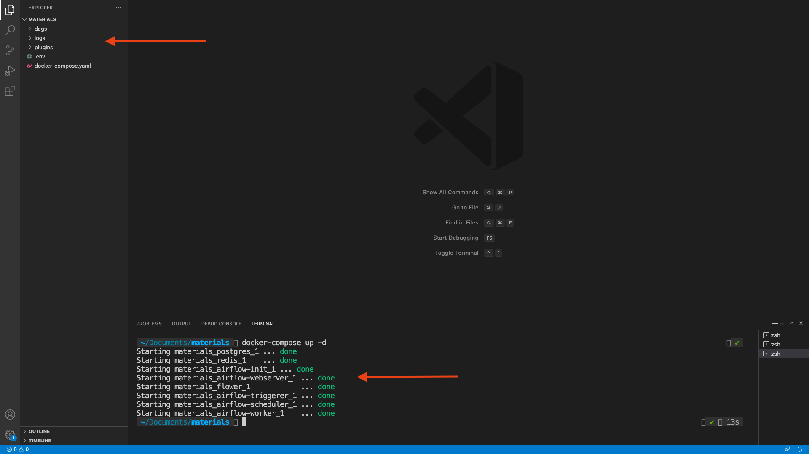

7. Una vez instalado vamos a __localhost_8080__

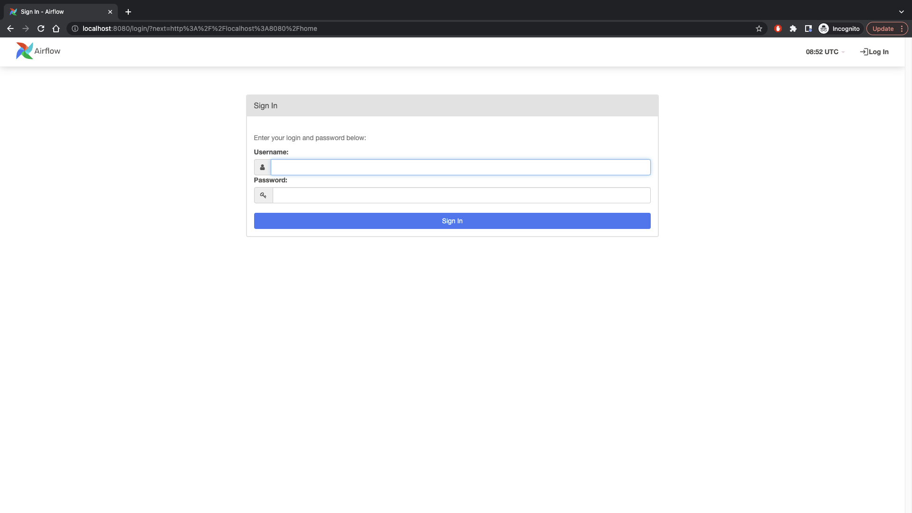

__IMPORTANTE__

Podemos chekear el correcto funcionamiento de la aplicaciones desde:

```yaml
docker-compose ps
```

Ante un error buscamos en los logs y detenemos el container.

```yaml
docker logs materials_name_of_the_container
docker-compose down
docker volume prune
docker-compose up -d 
```

### Logeo en Airflow Web-Server

El servicio de Web-Server de Airflow es lo último que levanta y puede tardar mas de 10 minutos.
Ingresamos con airflow/airflow

Lo primero que vamos a ver son los ejemlos que ya vienen por ejemplo.

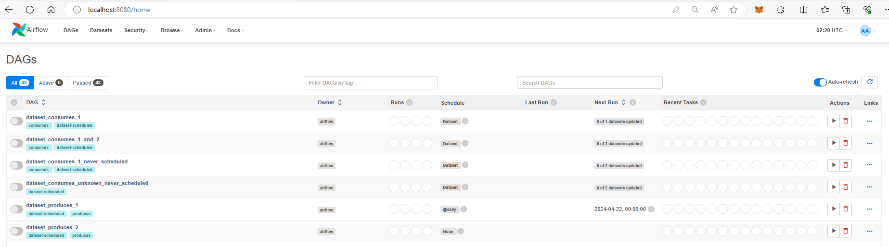

en esta pantalla inicial vemos informacion relacionada a los DAGS y a su ejecución actual y pasada. Como por ejemplo, la cantidad de DAGS en cola de ejecución, los que se están ejecutando, los que dieron error, etc. 
Tambien vemos el último que ejecutó y el próximo que lo hará.

### Conociendo Airflow UI.

1. The Grid View

Cuando hacemos Click sobre un DAGS lo primero que vemos en the Grid View.
Lo que nos permite es ver la historia de los estados del DAGS.
Tambien nos muestra la cantidad total de __Task__ que contiene el DAG y los __Operators__ que usa.


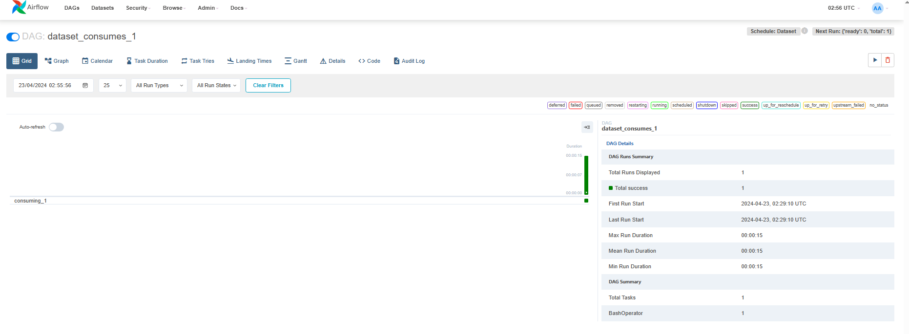

2. The Graph View

La vista __graph view__ es muy útil porque nos ayuda a ver como está hecho el DAG y cuales son las dependencias de cada __Task__

Al hacer click sobre cada __Task__ podemos ver propiedades de la misma.

3. Landing View

EL calendar view, es una vista que es útil a medida que vamos ejecutando una mayor cantidad de DAGs. Nos muestra el tiempo de ejecución de los __task__ y ver posibles optimizaciones y comparar contra otros DAGs.

4. Calendar View

En esta vista se ve la agregacion de cada ejecución por día de un DAG en particular. Nos ayuda a obtener patrones de patrones para ver que dias falla.

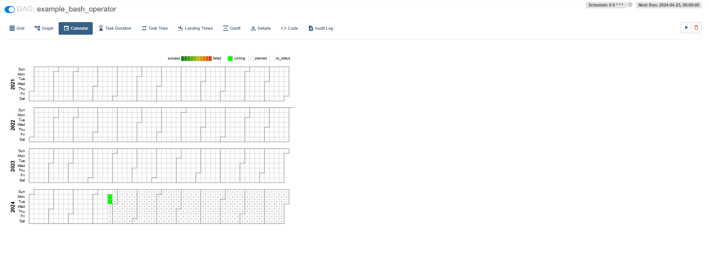

5. Gantt View

Es una de las vistas mas útiles para encontrar __bottelnecks__ en nuestros DAGs.

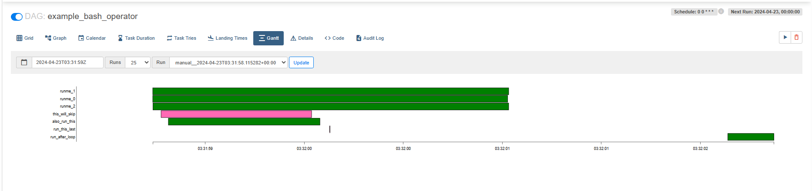

Mientras mas largo sea el rectangulo, mas tiempo tarda en ejecutar.
Si vemos que los rectangulos se sobreponen es porque podemos eejcutar en paralelo.

6. Code View.

La usamos para ver el código. La verdadera utilidad es cuando queremos ver que el código que modificamos ya impacto en __Airflow__


## 4. Proyecto Intro

### 4.1 Introducción.

Vamos a construit un __Pipelinne__.

1. Creamos una tabla en Postgres
2. Controlar si una API está disponible.
3. Cargar datos.

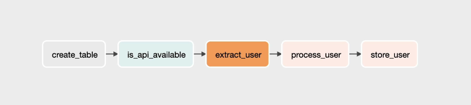

Para recordar, __¿Qué es un DAG?__

Es un Grafico Dirigido Aciclico o __Directed Aciclic Graph__
Tenemos Nodos que se corresponden con las __Task__ y __Edges__ que indica la relacion entre las tareas.

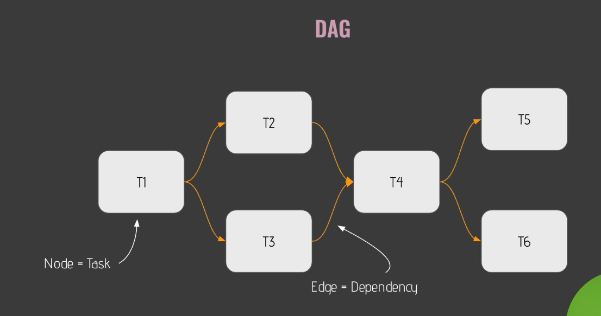

Estas relaciones pueden ser secuenciales o en Paralelo.

__No hay loops en un DAG__


### 4.3 creamos el primer DAG

Lo primero que vamos a hacer es, es la carpeta __DAG__ creamos un archiov llamado __user_processing.py__

```python
from airfow import DAG
from datetime import datetime

with DAG('user_processing', start_date=datetime(2024,4,23),
schedule_interval='@daily', catchup=False) as dag:
    None
```

|parametros|detalle|
|----------|-------|
|start_date|Es la fecha en la que el dag será incorporado al scheduler|
|schedule_interval|La frecuencia de ejecución.|
|catchup|Indica si se deben ejecutar los __dags__ que no se hayan ejecutado desde la ultima ejecución o puesta en producción.| 


### 4.4 Operadores

En los DAGs tenemos varias tareas  y esas tareas se definen como __Operadores__

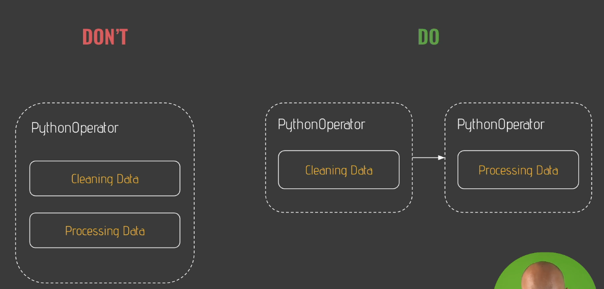

Cuando definimos operadores debemos considerar que sean lo mas atómicos posible. Por ejemplo un operador que sejecuta la __tarea de limpiar datos__ y luego __procesar datos__, estaria mal, deben ser dos separados.

_Existen tres tipos de Operadores_

|operador|descripcion|
|--------|-----------|
|Action Operator|Eejcuta una funcion o comando, como bash o python|
|Transfer Operators|Transfieren datos de una fuente a otra|
|Sensor Operator|Se utilizar para esperar a cumplir con cierta condición.|

Juntos con los __Operadores__ podemos acceder a otros servicios, como por ejemplo __AWS__ o __Dbt__ pero para poder usarlos necesitamos usar o instalar __Providers__

```shell
pip install apache-airflow-providers-amazon
```

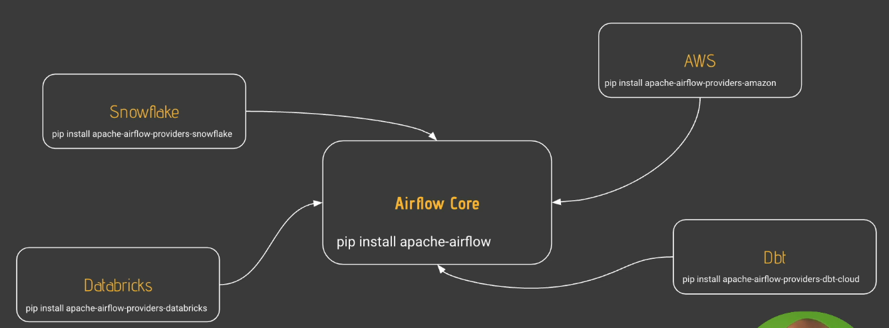


### Creacion de una tabla.

Una vez definido el DAG creamos una task para __crear una tabla__

```python
from airflow import DAG
from airflow.providers.postgres.operators.postgres import PostgresOperator
from datetime import datetime

with DAG('user_processing', start_date = datetime(2024,1,1),
schedule_interval = '@daily', ctachup = False) as dag:

    create_table = PostgresOperator(
        task_id = 'create_table',
        postgres_conn_id = 'postgres',
        sql = '''
        CREATE TABLE IF NOT EXISTS users(
            firstname TEXT NOT NULL,
            lastname TEXT NOT NULL,
            country TEXT NOT NULL,
            username TEXT NOT NULL,
            password TEXT NOT NULL,
            email TEXT NOT NULL
        );
        '''
        )
```

Levantamos el contenedor de __Airflow__ y buscamos en __UI__ el nuevo dag.

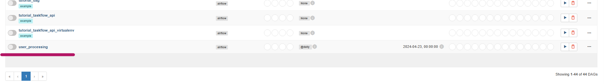

__IMPORTANTE__ el archivo .py debe estar en la carpeta de __DAGS__, la misma es un volumen externo del contenedor a nuestro equipo.

Ahora debemos crear la conexión a __postgres__ para que nuestro DAG la pueda usar.

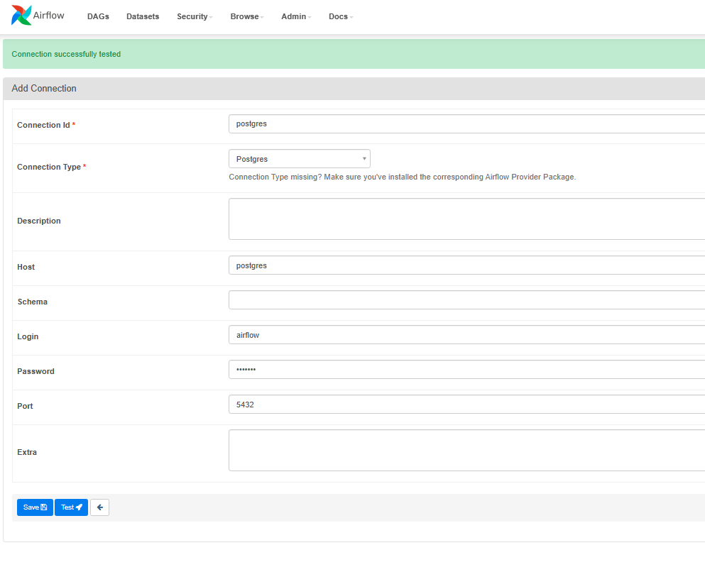


### Ejecutar un task de prueba.

Desde la linea de comando podemos entrar al contenedor del __Scheduler__ y probar un task de prueba.

en la terminal escribimos

```shell
docker ps

docker-compose ps
```

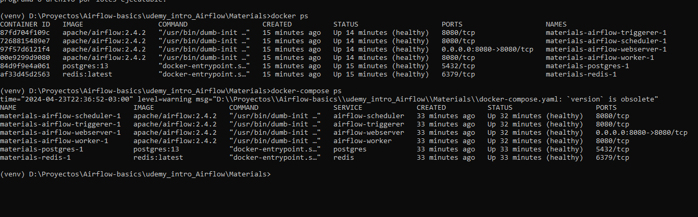

y buscamos el nombre del contenedor del scheduler y escribimos:

```shell
docker exec -it docker-scheduler /bin/bash
```

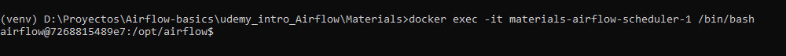

Ahora estamos dentro del contenedor del schedular y podemos ejecutar un __DAG__ de prueba.
Para esto necesitamos el nombre de nuestro DAG y el de la Tarea que queremos ejecutar.

```shell
airflow tasks test _DAG_ID _TASK_ID
```

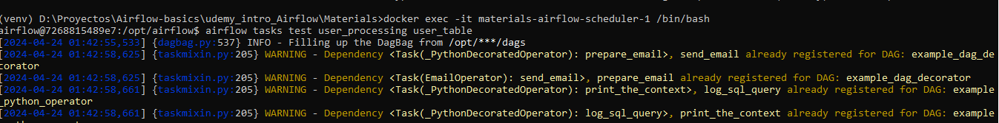

El resultado es __SUCCESSED__


### Sensores

```
Los sensores son útiles cuando estamos esperando que algo ocurra antes de ejecutar una Task. Por ejemplo, esperar un archivo o a que una API este disponible.
```

Los sensores tienen dos propiedades importantes:

|propiedad|descripcion|
|---------|-----------|
|timeout|El tiempo maximo de vida del sensor|
|poke_interval|Por defecto son 60 segundos, ss el intervalo para verificar si la condicion es True|

Agremoas un sensor en el proceso.


1. Agregamos un __Sensor para saber si una API está disponible__

```python
from airflow.providers.http.sensors.http import HttpSensor

is_api_available = HttpSensor(
    task_id ='is_api_available',
    http_conn_id='user_api',
    endpoint = 'api/'
)
```

__IMPORTANTE__ este sensor usa una API y necesita una connection que vamos a crear desde la UI.

2. Extraccion de datos de la API.

Una vez hecha la conexión a la API debemos extraer los datos, para lo cual usamos el __operador SimpleHttpOperator__

```python
from airflow.providers.http.operators.http import SimpleHttpOperator
import json

extract_user = SimpleHttpOperator(
    task_id = 'extract_user',
    http_conn_id = 'user_api',
    endpoint = 'api/',
    method = 'GET',
    response_filter = lambda response: json.loads(response.text),
    log_response=True
    )
```

### Python Operator - Processing

Una vez extraidos los datos de la API, los vamos a procesar con un __PythonOperator__

```python
import json
from pandas import json_normalize
from datetime import datetime
from airflow.operators.python import PythonOperator

def _process_user(ti):
    user = ti.xcom_pull(task_ids="extract_user")
    user = user['results'][0]
    processed_user = json_normalize({
        'firstname': user['name']['first'],
        'lastname': user['name']['last'],
        'country': user['location']['country'],
        'username': user['login']['username'],
        'password':user['login']['password'],
        'email':user['email']})

    processed_user.to_csv('/tmp/processed_user.csv', index=None, header=False)

process_user = PythonOperator(
    task_id = 'process_user',
    python_callable = _process_user
)
```

Cuando usamos una función de Pyhton que va a ser llamada desde un __PythonOperator__ le pasarmos un parametro que es __ti__ que significa __Task Instance__

Hasta ahora el __DAG__ o Pipeline quedó así. Necesitamos agregarle las dependencias o __edges__

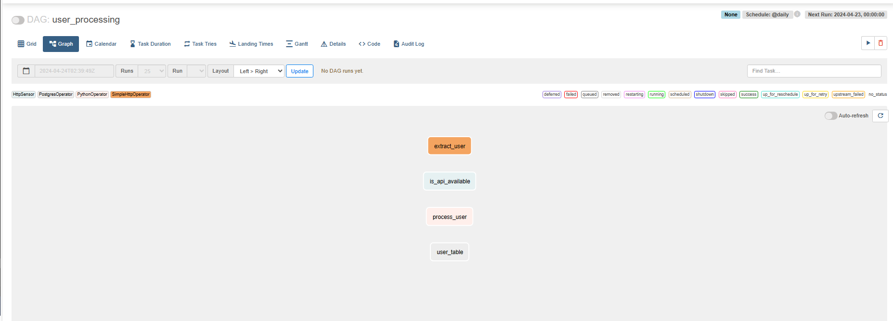


### __¿Qué son los Hooks?__ y Carga de datos

Son herramientas para interactuar con distintas tecnologias con un mayor nivel de abstracción.
Por ejemplo usamos un __PostgresOperator__ para conectarnos a __Postgres__ pero detrás se usa __PostgresHook__

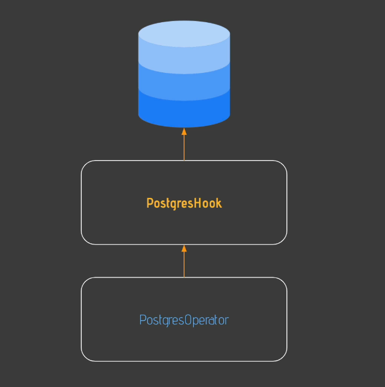

Usando los __Hooks__ podemos obtener acceso a metodos que quizas con un __operator__ no.

Ahora seguimos con la carga de los datos.

```python
from airflow.providers.postgres.hooks.postgres import PostgresHook

def _store_user():
    hook = PostgresHook(postgres_conn_id = 'postgres')
    hook.copy_expert(
        sql="COPY users FROM stdin WITH DELIMITER as ','",
        filename = '/tmp/processed_user.csv'
    )

store_user = PythonOperator(
    task_id = 'store_user',
    python_callable=_store_user
    )
```

Para comprobar que todo ejecutó OK vamos a entrar al contenedor de Postgres

```shell
docker-compose ps
docker exec -it postgres-img-1 /bin/bash
> psql -Uairflow
```

```sql
select *
from users;
```

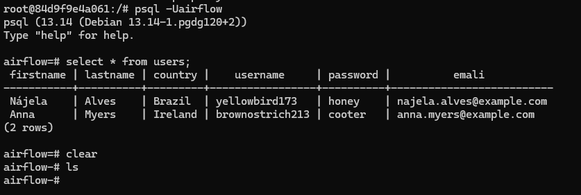


### Schedule DAGs.

|parametro|detalle|
|---------|-------|
|start_date|La fecha desde la cual el Scheduler intantará hacer el backfill|
|schedule_interval| How often ejecuta.|
|end_date|La fecha en la cual queremos que l dag deje de ejecutar|

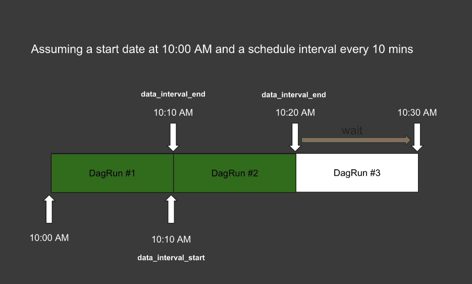

Hay que notar que entre cada intervalo espera 10 inutos hasta que comienza la proxima ejecución.

El DAG es ejecutado a la fecha de la ultima ejecución + el __schedule Interval__

### Backfilling y CatchUP

Usamos CatchUp cuando queres ejecutar Dags que no se ejecutaron.
Usamos Backfilling cuando queremos ejecutar DASGs anteriores a nuesro start_date.

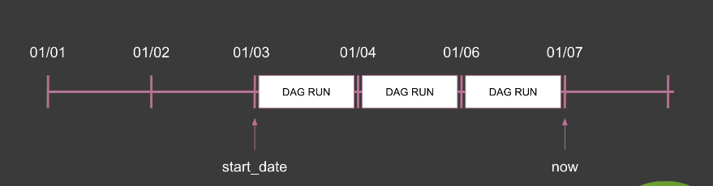

En este ejemplo tenemos un DAG que creamos el 01/03 pero la primer ejecución fué el 01/07 como tiene activado el __CatchUp__ lo que va a hacer es ejecutar los tres __DAG RUNS__ que no se ejecutaron.

El __backfilling__ es similar, solo que en lugar de ejecutar desde la ultima fecha que ejecutó, lo hacemos desde un punto anterior o __historia__

EN este caso ejecutariamos el __01/01__ y el __01/02__.

## 5. Nueva forma de usar Scheduler

La forma tradicionar de __Agendar__ un DAG era definiendo un __TimeInterval__ ya sea __Diario__ __Mansual__ etc.
La nueva forma de agendar DAGS es por medio de __Files Updates__.

### 5.1 Casos de uso.

1. Update sql

```
Tenemos el caso de un equipo de Ingenieria de datos que crea los DAGS T1 T2 y T3 que carga datos en SQL y otro equipom que tiene los DAGS TA TB y TC que lo consumen una vez cargado.
```

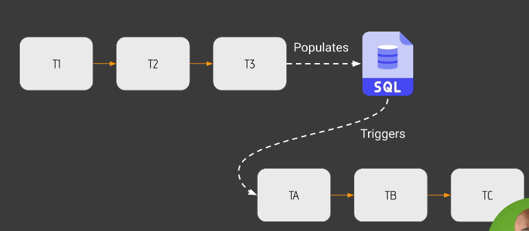

Para que un equipo se entere que los datos están disponibles se debe usar __TriggerOperator__ __ExternalTaskOperator__ pero son muy complejos.
Que permiten desencadenar un DAGs luego de la ejecución de otro DAG.


2. Update de file para disparar otro dag.

Tenemos el caso donde queremos disparar un Trigger inmediatamente despues de haber hecho un update de datos __SIMILAR A UN CDC__

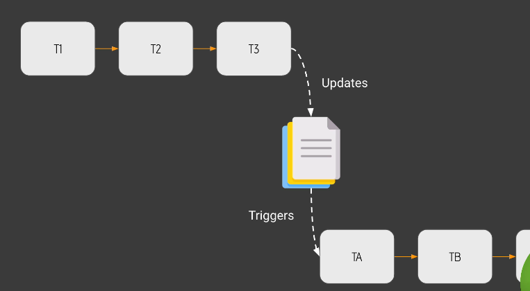


3. Particion de Pipelines en Micro Pipelines.

Tenemos un Pipeline con varios DAGS pero para facilitar el trabajo en equipos poemos dividirlo en __Micro Pipelines__ y estos __micro Pipelines__ dependen de otros usando el nuevo feature de __Scheduling__

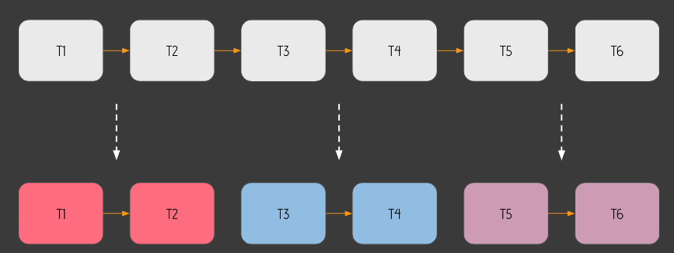


### 5.2 DataSets.

Es una agrupación lógica de Data. No importa que sea un FILE o SQL.
El DataSet tiene dos Propiedades:
1. URI -> es el path al dataset o Identificador único.
2. EXTRA -> informacion adicional en formato JSON.

__ejemplo__

```python
from airflow import Dataset

schemeless = Dataset("/path/file.txt")
csv_file = Dataset("file.csv")

my_file = Dataset(
    "s3://dataset/file.csv",
    extra={'owner':'james'}
)
```

__Como se hacia antes y ahora__

```python
#before
with DAG(schedule_intervl='@daily')

with DAG(timetable=MyTimeTable)

#Ahora.
with DAG(schedule=)
```

_MyTimeTable_ es como un calendario que defino con la ejecución del PipeLine.

__Ahora usamos _schedule_ donde podemos poner _crone expression_ _time delta object_ o _Dataset___


### 5.3 Implementacion

```python
from airflow import DAG, Dataset
from airflow.decorators import task

from datetime import datetime

my_file = Dataset("/tmp/my_file.txt")

with DAG(
    dag_id="procedurer",
    schedule="@daily",
    start_date=datetime(2024,1,1),
    catchup=False
):

    @task(outlets=[my_file])
    def update_dataset:
        with open(my_file.uri , "a+") as f:
            f.write("producer update")

    update_dataset()
```

__from airflow.decorators import task__ Nos permite crear tareas de una forma mucho mas rápida.

__@task(outlets=[my_file])__ es necesario indicar a __airflow__ que el task __update dataset__ actualiza el dataset __my_file__.


+ Este proceso es el encargado de hacer __update__ al archivo, es el __producer__. Este archivo debe ser consumido por un __consumer__

```python
from airflow import Dataset, DAG
from airflow.decorators import task

from datetime import datetime

my_file = Dataset("tmp/my_file.txt")

with DAG(
    dag_id = "consumer",
    schedule=[my_file],
    startdate=datetime(2024,1,1),
    catchup=False
):

    @task
    def read_dataset():
        with open(my_file.uri, "r") as r:
            print(f.read())


    read_dataset()
```

+ Este proceso es el __consumer__ que debe hacer referencia al mismo archivo __schedule=[my_file]__. En el parametro __schedule__ ya no tenemos una __crone expression__ sino el archivo que se actualiza.

### Ejecucion.

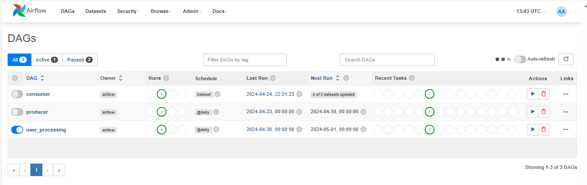

En la interfaz de Airflow vermos que tenemos los dos procesos creados y en el proceso del __consumidor__ vemos que su schedule es __Dataset__ lo que quiere decir que es ejecutado cuando hay cambios en el __file__

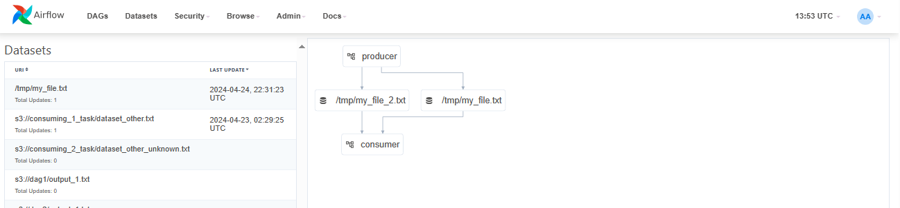

Si iniciamos el consumidor no pasará nada hasta que se ejecute el __Productor__

Podemos tener uno o varios __Datasets__, pero si vamos a tener mas de uno hay que tener en cuenta que el DAG debe esperar por los dos __DAtasets__ y no solo uno.


## 6. Executors

Lo mas importante de los __Executors__ es que no ejecutan las tareas. Sino que define como se van a ejecutar las tareas o en que __sistemas__

|tipo de ejecutor|descripcion|
|----------------|-----------|
|Sequential|Se ejecuta sobre la maquina local de una tarea a la vez|
|Local|Se ejecutan multiples tareas sobre la maquina local|
|celery|Se ejecuta sobre varios workers o varios clusters|
|K8s|Se ejecuta sobre Kubernetes clusters en varias maquinas|

__La forma del executor__ se define en el archivo __docker-compose__

### 6.1 Default executor

Para obtener el archivo de configuracion vamos a una terminar y escribimos.

```cmd
docker-compose ps
docker cp material-airflow-scheduler-1:/opt/airflow/airflow.cfg .
```

Una vez descargado o copiado el __config__ file de Airflow podemos modificarlo.

Dentro del archivo vemos que __executor__ está seteado en SequentialExecutor, esta configuracion viene del __docker-compose__

#### ¿Porqué si docker-compose y airflow.cfg están distintos?

porque __docker-composer__ modifica la variable de sistema 
_AIRFLOW__CORE__EXECUTOR: CeleryExecutor_ haciendo que se ejecute con __celery__ por mas que en __airflow.cfg__ diga Sequential.

#### 6.2 Sequential Executor.

Este ejecutor trabaja con tareas secuenciales. Espera a la finalizacion de una tarea antes de empezar con otra. No tiene paralelismo.

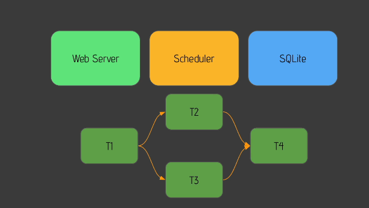

En el caso de las tareas T2 y T3 primero ejecuta una luego la otra y con las dos finalizadas puede comenzar con T4.

__Solo lo usamos con fines de Debugging o testing__


#### 6.3 The Local Executor.

Permite ejecutar multiples tareas al mismo tiempo pero sobre una única máquina.

En esta configuración no se puede usar __sqlite__ debemos usar __postgres oracle etc__

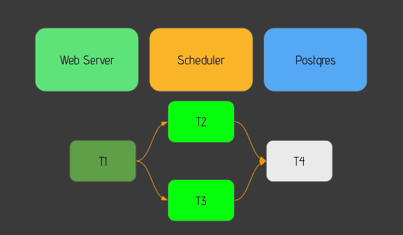

En este ejemplo las tareas T2 y T3 se ejecutan en paralelo.

```d
executor=LocalExecutor

sql_alchemy_conn=postgresql+psycopgq2://<user>:<password>@<host>/<db>
```

__El localExecutor no escala muy bien__ depende de los recursos que tengamos.

#### 6.4 CeleryExecutor

Se usa para incrementar el numero de tareas que podemos ejecutar el mismo timpo en varios clusters en varias máquinas.

Este executor está compuesto por una __Celery Queue__ que tiene __result broker__ que almacena los resultados de las tareas ejecutadas y un __broker__ que es una cola que tiene las tareas que serán tomadas por los __workers__

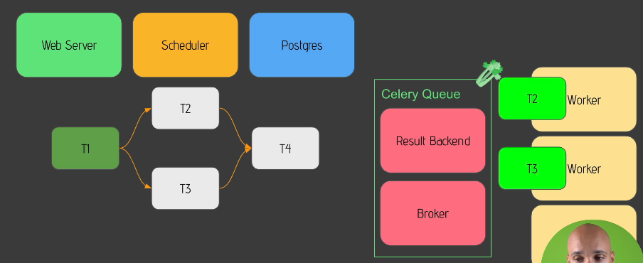

Para ejecutar este DAG airflow envia el las tareas del DAG al broker y espera hasta que la toma un broker, una vez completada almacena el estado en el Result Backend y continua con las tareas T2 y T3 que seran tomadas en forma simultanea por otros Workers.

Para poder trabajar con este executor necesitamos instalar una cola de __redis__

```d
executor=CeleryExecutor

sql_alchemy_conn=postgresql+psycopq2://<user>:<password>@<host>/<db>

celery_result_backend=postgresql+psycopq2://<user>:<password>@<host>/<db>

celery_broker_url=redis://:@redis:6379/0
```

__En este ejemplo tenemos configurado el executor en Celery con la base REdis y Postgres y un Worker__ tambien tenemos __flower__ para monitorear la ejecución de los workers.

1. Creamos el archivo parallel.py para ejecutar tareas en paralelo.

```python
from airflow import DAG
from airflow.operators.bash import BashOperator
from datetime import datetime

with DAG(
    dag_id="parallel_example",
    schedule="@daily",
    start_date=datetime(2024,5,1),
    catchup=False) as dag:
    
    extract_a = BashOperator(
        task_id='extract_a',
        bash_command="sleep 1"
    )
    
    load_a = BashOperator(
        task_id="load_a",
        bash_command="sleep 1"
    )
    
    extract_c = BashOperator(
        task_id="extract_c",
        bash_command="sleep 3"
    )
    
    load_c = BashOperator(
        task_id="load_c",
        bash_command="sleep 2"
    )
    
    transform = BashOperator(
        task_id="transform",
        bash_command="sleep 2"
    )
    
    extract_a >> load_a
    extract_c >> load_c
    [load_a, load_c] >> transform

```

La vista nos muestra tareas que se ejecutan en paralelo.

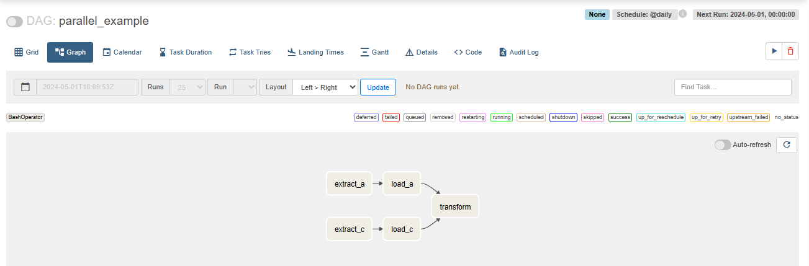

Para monitorear esta tarea vamos a usar flower para monitorearlo pero para poder iniciar __flower__ neceitamos reiniciar __docker-compose__ con el comando

```shell
docker-compose down && docker-compose  --profile flower up -d
```
Ingresamos a: _localhost:5555__

Esta vista nos muestra los procesos activos y sus estados y los workers disponibles y vemos la informacion del worker.
Dentro de la vista de los __Wrokers__ tenemos el pool que estable la cantiad de teareas en paralelo que podemos ejecutar, por defecto 16.
Hay otra pestaña __Queues__ donde podemos especificar tareas de alto consumo y hacer que sean tomadas solo por este worker.

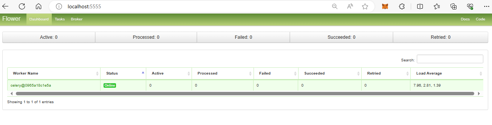

Cuando ejecutar el DAG vemos que __flower__ lo detecta y muestra la cantidad de tareas en ejecucion y las finalizadas.

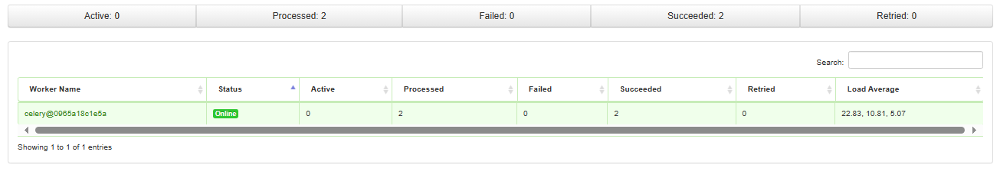


#### 6.4.1 ¿Como setear una Queue?

Una Queue funciona como First in First Out. La primer tarea que ingresa es la primera que sale.

Quizas tenemos la necesidad de encolar tareas que demanden distintos recursos por ejemplo:

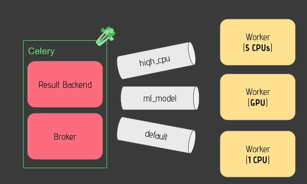

Por ejemplo un worker que tiene un GPU otro con mas recursos y otro con menos recuros. Esto lo podemos configurar usando __Queues__, incluso podemos crear una cola para modelos de __ML__

Para este ejemplo vamos a crear un nuevo worker para definir a cual va ala cola.
En el archivo __docker-compose__ copiamos el codigo de __worker__ y le ponemos un nuevo nombre __worker-2__ y reiniciamos docker-compose 

```shell
docker-compose down && docker-compose up -d
docker-compose ps
```

Deberiamos ver dos workers al igual que en __flower__.


```yaml
airflow-worker-2:
    <<: *airflow-common
    command: celery worker
    healthcheck:
      test:
        - "CMD-SHELL"
        - 'celery --app airflow.executors.celery_executor.app inspect ping -d "celery@$${HOSTNAME}"'
      interval: 10s
      timeout: 10s
      retries: 5
    environment:
      <<: *airflow-common-env
      # Required to handle warm shutdown of the celery workers properly
      # See https://airflow.apache.org/docs/docker-stack/entrypoint.html#signal-propagation
      DUMB_INIT_SETSID: "0"
    restart: always
    depends_on:
      <<: *airflow-common-depends-on
      airflow-init:
        condition: service_completed_successfully
```

Para crear una cola en un worker especifico lo que debemos hacer es, al codigo anterior le agregamos el comando:


```yaml
airflow-worker-2:
    <<: *airflow-common
    command: celery worker -q high_cpu
    healthcheck:
```

De esta forma creamos un nuevo worker que contiene la cola __QUEUE__ high_cpu y podemos definir tareas que corran sobre esa cola. Vemos que el nuevo worker tiene la nueva cola miestras que los otros trabajan con la cola default.

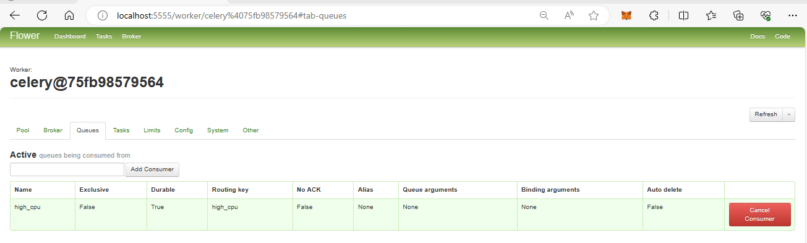


#### 6.4.2 ¿Como enviar una tarea a una Queue?

Dentro de nuestro DAG en cada operador podemos especificar un nuevo parametro __queue__ donde especificamos el nombre de la cola a la que lo queremos enviar.

_Siguiendo con el ejemplo anterior_.

```python
    load_c = BashOperator(
        task_id="load_c",
        queue = 'high_cpu',
        bash_command="sleep 2"
    )
```

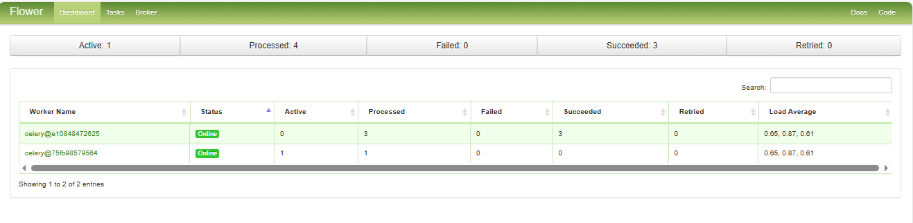

vemos que cuanod lo ejecutamos el segundo worker toma la tarea que fué especificada porque es el que contiene la cola "high_cpu".


## 7. Conceptos avanzados


### 7.1 SubDags

```
Un subDag es un Dag con las tareas que queremos agrupar.
```

Son una tecnica que nos permite agrupar tareas similares dentro de un único Dag y así evitar tareas repetitivas.


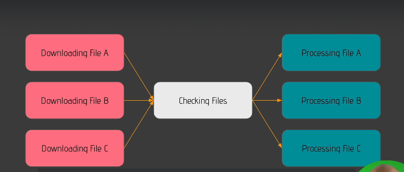

En este ejemplo vemos que tenemos tres tareas para __download__ un archivo y otras tres para procesarlos. Lo que podemos hacer es agruparlas para que quede mas legible.

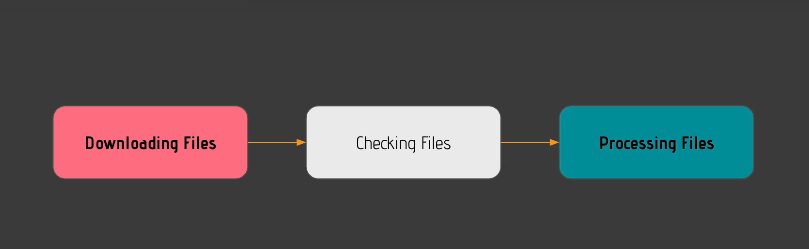

Esto hace que podamos organizar mejor nuestro Dag.

#### Creamos el siguiente Dag en la carpeta de dags.

__El nombre del archivo es _group_dag.py___

```python
from airflow import DAG
from airflow.operators.bash import BashOperator
 
from datetime import datetime
 
with DAG('group_dag', start_date=datetime(2022, 1, 1), 
    schedule_interval='@daily', catchup=False) as dag:
 
    download_a = BashOperator(
        task_id='download_a',
        bash_command='sleep 10'
    )
 
    download_b = BashOperator(
        task_id='download_b',
        bash_command='sleep 10'
    )
 
    download_c = BashOperator(
        task_id='download_c',
        bash_command='sleep 10'
    )
 
    check_files = BashOperator(
        task_id='check_files',
        bash_command='sleep 10'
    )
 
    transform_a = BashOperator(
        task_id='transform_a',
        bash_command='sleep 10'
    )
 
    transform_b = BashOperator(
        task_id='transform_b',
        bash_command='sleep 10'
    )
 
    transform_c = BashOperator(
        task_id='transform_c',
        bash_command='sleep 10'
    )
 
    [download_a, download_b, download_c] >> check_files >> [transform_a, transform_b, transform_c]
```

Desde la vista de Airflow se veria así.

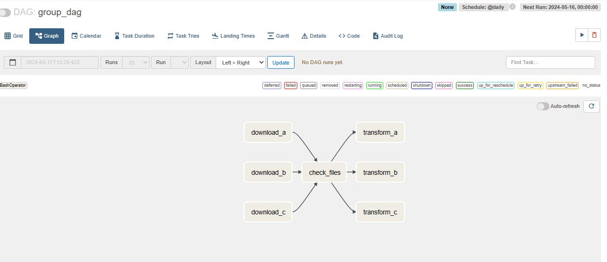

Para poder crear subDags lo que hacemos es.

1. Creamos una nueva carpeta dentro de _Dags_ con el nombre __Subdags__
y dentro de esta un nuevo archivo __subdag_downloads.py__

EL concepto mas importante es que el .py que contendra los dags tiene una función que devuelve un __dag object__

```python
from airflow import DAG
from airflow.operators.bash import BashOperator

def subdag_download(paren_dag_id, child_dag_id,  args):

    with DAG(f"{parent_dag_id}.{child_dag_id}",
    start_date=args['start_date'],
    schedule_interval=args['schedule_interval'],
    catchup=args['catchup']) as dag:

        download_a = BashOperator(
            task_id='download_a',
            bash_command='sleep 10'
        )

        download_b = BashOperator(
            task_id='download_b',
            bash_command='sleep 5
        )

        doenload_c = BashOperator(
            task_id='download_c',
            bash_command='sleep 20'
        )

    return dag
```

2. En el directorio dags creamos un nuevo file que se llamará __group_dag_2.py__ que contendrá los subDags y agregamos las siguientes lineas.

```python

from airflow import DAG
from airflow.operators.bash import BashOperator
from airflow.operators.subdag import SubDagOperator
from subdags.subdags_downloads import subdag_downloads

from datetime import datetime

with DAG('group_dag', start_date=datetime(2024,5,17),
schedule_interval='@daily', catchup=False) as dag:

    args = {'start_date':dag.start_date, 'schedule_interval':dag.schedule_interval, 'ctachup':dag.catchup}

    downloads = SubDagOperator(
        task_id='downloads',
        subdag=subdag_dowloads(dag.dag_id, 'downloads', args)
    )

    checkfile = BashOperator(
        task_id='checkfile',
        bash_command='sleep 10'
    )

    load_a = BashOperator(
        task_id='load_a',
        bash_command='sleep 3'
    )


    load_b = BashOperator(
        task_id='load_b',
        bash_command='sleep 3'
    )


    load_c = BashOperator(
        task_id='load_c',
        command='sleep 3'
    )

    download >> checkfile >> [load_a, load_b, load_c]
```

3. Controlamos la vista en Graph.

Se debería ver algo así.

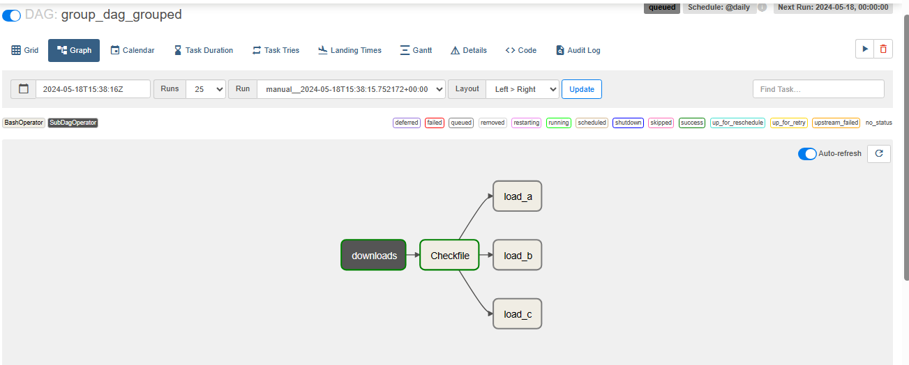

```
importante: El subdagId debe ser igual al taskId. En este caso es "downloads"
y finalmente cambiamos las dependencias.
Tambien deben coincidir start_date, catchup y schedule_interval.
```

Tambien podemos ver lo que hacer dentro del subDag haciendo __zoom subdag__ luego de la ejecucion.

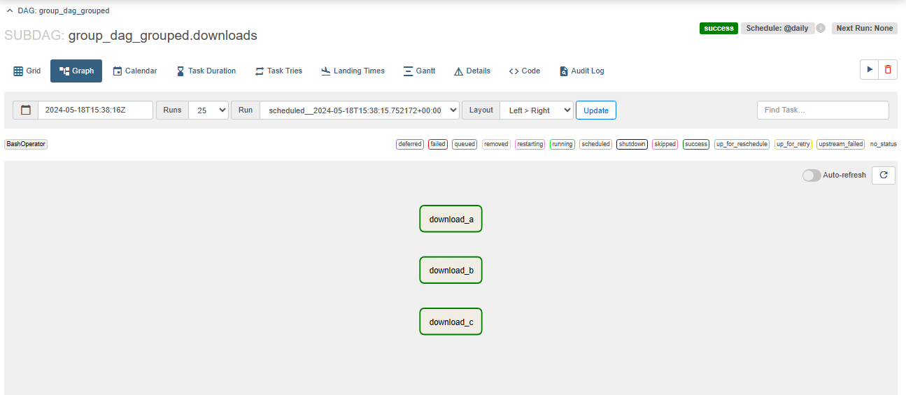


### 7.2 TaskGroups.

Los Task Groups son una vesión mejorada de los SubDags que permiten mas legibilidad y código ordenado. 

__Los subDags fueron deprecados desde la version Airflow 2.2__

1. Vamos a crear dentro de la carpeta __dags__ una subfolder on el nombre __groups__ con los archivos group_download.py y group_tarnsform.py


2. group_transform.py

```python

from airflow import DAG
from airflow.operators.bash import BashOperator
from airflow.utils.task_group import TaskGroup


def tarnsform_task():
    with TaskGroup('transformGroup', tooltip="My transform task") as group:
        
        transform_a = BashOperator(
            task_id="transform_a",
            bash_command="sleep 1"
        )
        
        transform_b = BashOperator(
            task_id="transform_b",
            bash_command="sleep 4"
        )
        
        transform_c = BashOperator(
            task_id="transform_c",
            bash_command="sleep 1"
        )
        
        
    return group

```

3. group_download.py

```python
from airflow import DAG
from airflow.operators.bash import BashOperator
from airflow.utils.task_group import TaskGroup

def download_task():
    
    with TaskGroup("downloadsGroup", tooltip="Download task") as group:
        
        download_a = BashOperator(
            task_id = "Download_a",
            bash_command= "sleep 10"
        )
        
        download_b = BashOperator(
            task_id="download_b",
            bash_command="sleep 20"
        )
        
        download_c = BashOperator(
            task_id = "download_c",
            bash_command="sleep 2"
        )      
        
    return group
```

4. archivo py principal _group_dag_taskGroup.py__

```python
from airflow import DAG
from airflow.operators.bash import BashOperator
from groups.group_download import download_task
from groups.group_transform import tarnsform_task

from datetime import datetime

with DAG(dag_id="TaksGrouped_dag", start_date=datetime(2024,5,18), 
         schedule_interval="@daily", 
         catchup=False) as dag:
    
    
    downloads = download_task()
    
    checkfile = BashOperator(
        task_id = "checkFile",
        bash_command="sleep 2"
    )

    transform = tarnsform_task()
    
    
    downloads >> checkfile >> transform
```

Deberiamos ver algo asi.

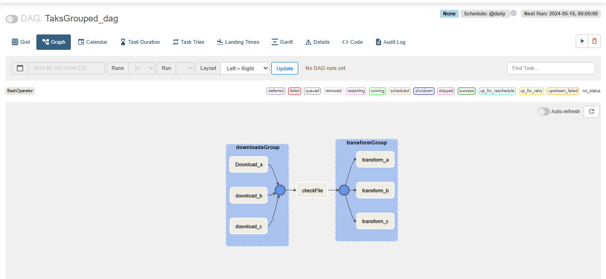

IMPORTANTE: __ Los nombres de las tareas deben ser únicos entre todos los dags, por eso a estas les ponemos downloadsGroup__ porque __downloads__ ya existia.


### 7.3 Exchange data between tasks

Podemos compartir data enre tareas usando __XComs__

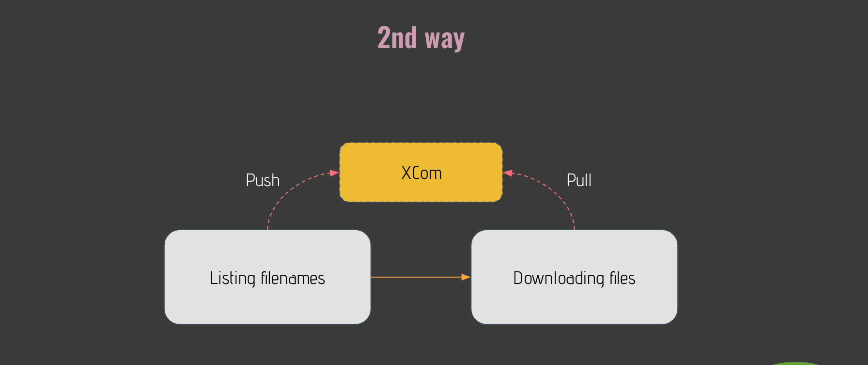

Tenemos una tarea con los nombres de los archivos que queremos procesar, los sube a una cola Xcoms y la siguiente tarea toma estos nombres y los procesa.

__XComs__ Cross Communication permite intercambiar pequeñas cantidades de datos. Según la BD puede ser de 2GB SqlLite a 64KB en MySql.

Para poder compartir datos dentro del __XCom__ de cada funcion de Python debemos usar los métodos __push__ y __pull__ con __clave/valor__


1. Queremos compartir data entre la tarea T1 y T2.

```python
from airflow import DAG
from airflow.operators.python import PythonOperator
from datetime import datetime

def _t1(ti):
    ti.xcom_push(key='my_key', value=[42, 3,5,6])
    
def _t2(ti):
    dato = ti.xcom_pull(key='my_key', task_ids = 't1')
    for d in dato:
        print(d)

with DAG(dag_id="xcom_example", start_date=datetime(2024,5,18),
         schedule_interval="@daily",
         catchup=False) as xcom_e:
    
    t1 = PythonOperator(
        task_id = "t1",
        python_callable=_t1
    )
    
    t2 = PythonOperator(
        task_id="t2",
        python_callable=_t2
    )
    
    
    
    t1 >> t2
```
__¿Qué es ti?__

Es un parametro que indica que estamos trabajando en esa instancia y tienen los metodos de __XComs__

En el log de xcoms deberiamos ver algo así.

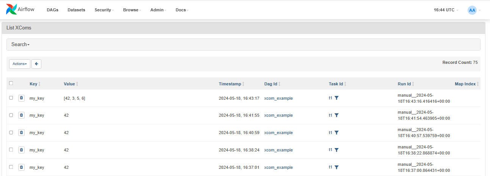


### 7.3 Branches 

En airflow podemos elegir una tarea u otra de acuerdo al flujo de ejecución que querramos. Usamos el BrachOperator.

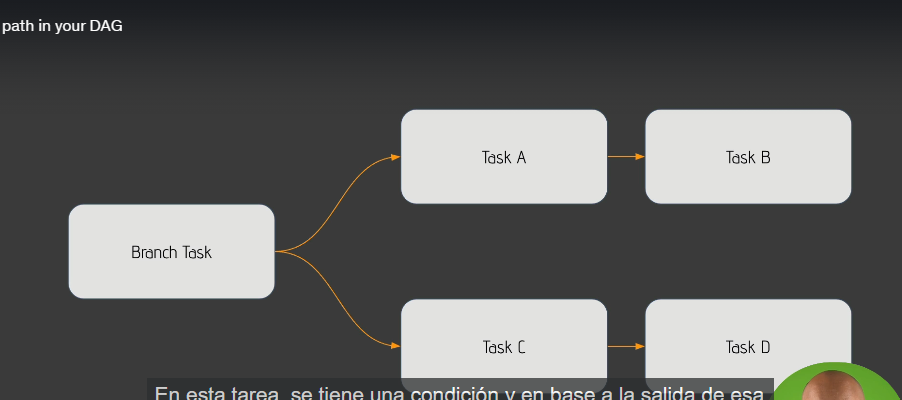

Para poder implementar una branch lo que hacemos es usar XCOms para pasar un valor de una funcion de python a otra y poder decicir por un flujo especifico.

1. Creamos el archivo __branches.py__ para crear una branch.

```python
from airflow import DAG
from airflow.operators.bash import BashOperator
from airflow.operators.python import PythonOperator, BranchPythonOperator

from datetime import datetime


def _t1(ti):
    ti.xcom_push(key='mi_clave', value=[1,0])

def _t2(ti):
    print('Se ha ejecutado la tarea t2')
    final = ti.xcom_pull(key='clave_branch', task_ids='branchOp')
    print(final)

def _t3(ti):
    print('se ha ejecutado la tarea t3')

def _branch(ti):
    value = ti.xcom_pull(key='mi_clave', task_ids='t1')
    ti.xcom_push(key='clave_branch', value=[987,789])
    if value[0] == 1:
        return 't2'
    return 't3'

with DAG(dag_id='myBranchDag', start_date=datetime(2024,5,18),
         schedule_interval="@daily",
         catchup=False) as dag:
    
    t1 = PythonOperator(
        task_id='t1',
        python_callable=_t1
    )
    
    branch = BranchPythonOperator(
        task_id = 'branchOp',
        python_callable=_branch
        
    )
    
    t2 = PythonOperator(
        task_id='t2',
        python_callable=_t2
    )
    
    t3 = PythonOperator(
        task_id='t3',
        python_callable=_t3
    )


    t1 >> branch >> [t2, t3]
```

```
Este ejemplo lo hicimos un poco mas complejo, ya que de la branch vamos a sacar otro xcom que se ejecute dentro del flujo destino con su propia clave.
```

__¿Qué pasa si queremos agregar una task mas al final?__ 

EL DAG va a fallar porque por defecto todas las tareas se deben ejecutar de forma correcta para ejecutar la siguiente. Pero esto se puede solucionar.
__Esto se hace con Trigger rules__

1. __all_success__

Para ejecutar una tarea todas deben terminar correctamente.

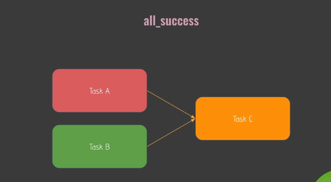


Para ejecutar la tarea C tanto A como B deben terminar OK, en este caso A falló, entonces C tiene el estado __Ascendente fallido__

2.- __all_failed__

Queremos ejecutar una tarea si todas las demas fallan. De otra forma, con que una ejecute de forma correcta la que le sigue es ignorada.

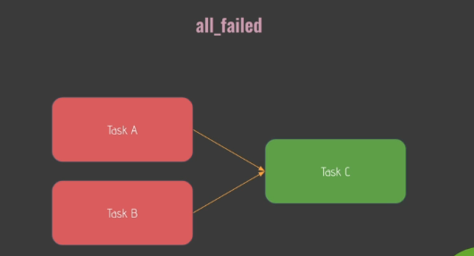

3. __all_done__

No nos importa el estado de las tareas anteriores, la que sigue siempre se ejecuta.

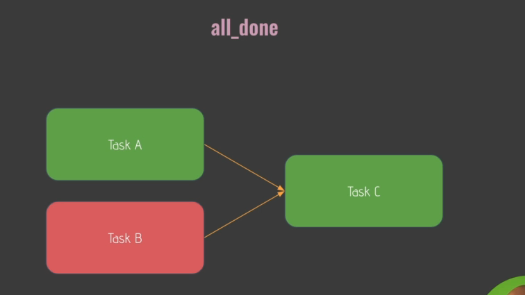

4. __one_success__

Si una tarea ejecuta OK entonces la que le sigue se dispara, sin importan otras tareas.

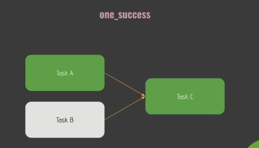

5. __one_failed__

Es la opuesta a 4. Si una falla la que le sigue se dispara.

6. __none_failed__

Si ninguna tarea falló o no se ejecutaron entonces la que sigue se ejecuta.

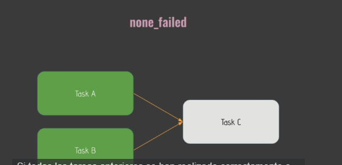

7. none_failed_min_one_success

Si una tarea ejecutó ok y la otra o no se ejecutó o dió error de todas formas se dispara la que sigue. __Es muy util en los Branches__

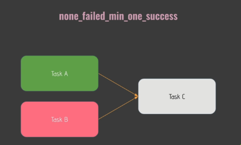

### 7.4 Creamos un ejemplo de Branch y Trigger

Este ejemplo es similar al anterior pero vamos a agregar una nueva tarea al final __t4__ y vamos a ahcer que se ejecute solo si una de las anterores ejecutó ok.

```python
from airflow import DAG
from airflow.operators.bash import BashOperator
from airflow.operators.python import PythonOperator, BranchPythonOperator

from datetime import datetime

def _t1 (ti):
    ti.xcom_push(key='key_t1', value = 34)

def _t2(ti):
    valor = ti.xcom_pull(key='valor_interno_branch', task_ids='brancherWithTrigger')
    print(valor)
    
def _t3(ti):
    valor = ti.xcom_pull(key='valor_interno_branch', task_ids='brancherWithTrigger')
    print(valor)
    
def _t4():
    print('Esta es la tarea final, no hace nada')

def _brancher(ti):
    valor = ti.xcom_pull(key='key_t1', task_ids='t1')
    ti.xcom_push(key='valor_interno_branch', value = [23,45,67])
    if valor >= 56:
        return 't2'
    return 't3'

with DAG(dag_id = 'myBranchWithTrigger', start_date = datetime(2024,5,18), 
         schedule_interval="@daily",
         catchup=False) as dag:
    
    
    t1 = PythonOperator(
        task_id='t1',
        python_callable=_t1
    )
    
    t2 = PythonOperator(
        task_id = 't2',
        python_callable=_t2
    )
    
    brancher = BranchPythonOperator(
        task_id = 'brancherWithTrigger',
        python_callable= _brancher
    )
    
    t3 = PythonOperator(
        task_id = 't3',
        python_callable=_t3
    )
    
    t4 = PythonOperator(
        task_id='t4',
        python_callable=_t4,
        trigger_rule='none_failed_min_one_success'
    )
    
    t1 >> brancher >> [t2, t3] >> t4
    
```

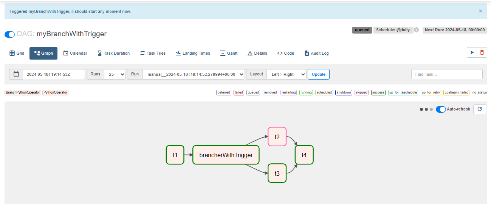


## 8. Docker Executor

